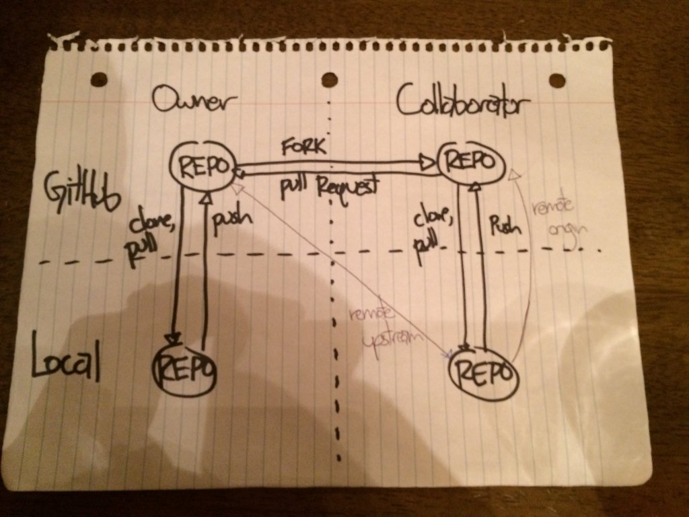

# Fork a repo {#fork}

In the previous prompt (chapter \@ref(clone)), we *cloned* someone else's repo to get a copy that we could keep up to date, by pulling new commits into our local copy.

What if you suspect you might want to propose a change to a repository? Then you should **fork** it, instead of clone it.

## Fork then clone

On GitHub, navigate to a repo of interest.

In the upper right hand corner, click Fork.

This creates a copy of the repo in your GitHub account and takes you there in the browser.

Use the usual workflow (chapter \@ref(clone)) to clone this to your local machine.

## Fork and pull

Make your changes locally, commit, then push back to your fork.

When/if you are ready to propose a change, you place a pull request from your fork on GitHub to the original repo owned by someone else.

Here's a sketch of how this looks:

## Updating your fork

It is harder to keep a fork updated than a clone. Why? Because the primary remote associated with your local is your fork. But you need to get the new commits from the repository you originally forked.

You need to have more than one *remote* associated with your local repo.

If you're nervous about command line Git, you update your fork on GitHub purely via the browser. Then pull to get the commits into your local repo:

  * [Updating a fork directly from GitHub](http://www.hpique.com/2013/09/updating-a-fork-directly-from-github/)
  
In the long run, you will want to learn how to configure a second remote for your local repo. Pull the new commits into your local repo, then push them to your own fork:

  * [GitHub Help: Syncing a fork](https://help.github.com/articles/syncing-a-fork/)
  
*Here's a [handwritten sketch](https://twitter.com/minisciencegirl/status/697236466867445760) devised with [Bill Mills](http://billmills.github.io) in a bar, but that will have to do for now!*

