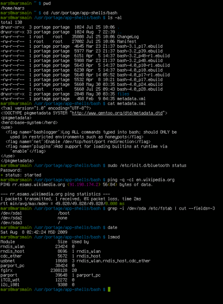
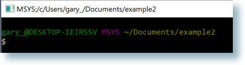
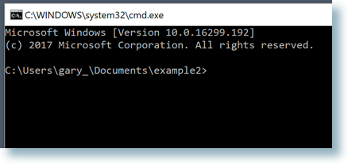
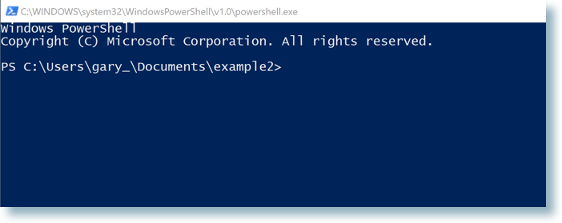
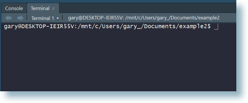

# (APPENDIX) Appendix {-}

# The shell {#shell}

Even if you do most of your Git operations via a client, such as RStudio or GitKraken, you must sometimes work in the shell. As you get more comfortable with Git, you might prefer to do more and more via the command line. You might also need to use Git or file system operations on a server that lacks your usual Git client. For all these reasons, you have to know a little bit about this.

## What is the shell?

The `shell` is a program on your computer whose job is to run other programs. Pseudo-synonyms are "terminal", "command line", and "console". There's a whole StackExchange thread on the differences ([What is the difference between Terminal, Console, Shell, and Command Line?](https://askubuntu.com/questions/506510/what-is-the-difference-between-terminal-console-shell-and-command-line)), but I don't find it to be terribly enlightening. Your mileage may vary.

Many programmers spend lots of time in a shell, as opposed to in GUIs, because it is very fast, concise, and ubiquitous in their relevant computing environments. This is how all work was done before we got the mouse and GUIs.

The most common shell is `bash` and it gets thrown around as a proxy for "shell" sometimes, just like "Coke" and "Kleenex" are proxies for cola and tissues.

Here we demo the use of a shell for quite modest goals: to navigate the file system, confirm the present working directory, configure Git, and configure Git remotes.

## Starting the shell

In RStudio, go to *Tools > Terminal* or *Tools > Shell*. The main difference is that *Tools > Terminal* launches a shell within RStudio, whereas *Tools > Shell* launches one external to RStudio. In both cases, RStudio makes every effort to launch the shell in a sane working directory, i.e. in the current project.

You should see a simple blinking cursor, waiting for input and look similar to this (white text on black background, or black text on white background):

<!-- why can bookdown not find this?!?

-->



## Windows is special ... and not in a good way

Windows is not the ideal platform for scientific computing and software development. A lot of the functionality is going to feel janky and strapped on. Because it is.

There are no fewer than 4 possible shells you can end up in. Unless you know better, you almost certainly want to be in a Git Bash shell.

#### Git Bash

This is a bash shell that ships with Git for Windows, which is [the Happy Git way to install Git on Windows](#install-git-windows). It is hopefully what RStudio will launch for you, especially from v1.1.383 and on. You can inspect and influence this directly via *Tools > Global Options > Terminal*. Unless you have good reason to do otherwise, you want to select "Git Bash" here.

A Git Bash shell should look something like this:



Notice `MSYS` in the title bar. You might also see `MINGW64`.

If you execute `echo $SHELL` in Git Bash, you should see `/usr/bin/bash`.

If you're seeing different shell-launching behavior *and you are running a very current version of RStudio and you followed the Happy Git installation instructions*, we [want to know](https://github.com/jennybc/happy-git-with-r/issues). Because that's not right.

Older versions of RStudio have a tick box in *Tools > Global Options > Terminal* for "Use Git Bash as shell for Git projects". If you won't or can't upgrade, then by all means select that. You might need to restart RStudio to see the effect and you must realize it only affects Projects that use Git. Let me be clear: my real advice to you is to upgrade RStudio.

#### Command prompt

This is the native Windows command line interpreter. It's rarely what you want, at least for the work described in this book. It looks something like this:



Notice the `cmd.exe` in the title bar.

In Command Prompt, `echo %comspec%` gives `C:\WINDOWS\system32\cmd.exe`.

If you get an error message such as `'pwd' is not recognized as an internal or external command, operable program or batch file.` from any of the commands given here, that suggests you have somehow launched into `cmd.exe`. 

#### Power Shell

Another Windows shell, more modern than the command prompt. Also probably not what you want. It looks something like this:



Notice the `powershell.exe` in the title bar.

In PowerShell ... wait for it ... `Get-ChildItem Env:ComSpec` gives:

``` bash
Name                 Value
-------              --------
ComSpec              C:\WINDOWS\system32\cmd.exe
```

#### Bash via Windows Services for Linux

In 2016, Microsoft launched the Windows Subsystem for Linux (WSL), "a new Windows 10 feature that enables you to run native Linux command-line tools directly on Windows". Overall, this is a fantastic development. However, at the time of writing (January 2018), you will only have this if you're running Windows 10 64-bit and have chosen to install the optional WSL system component. Therefore, I expect only keeners to have this and, in that case, you probably don't need this chapter. It looks something like this:



In this bash shell, `echo $SHELL` returns `/bin/bash`.

FYI Microsoft also refers to WSL as Bash on Ubuntu on Windows.

#### Windows bottom line

When in doubt, you probably want to be in a Git Bash shell.

## Using the shell

The most basic commands are listed below:

* [`pwd`](https://en.wikipedia.org/wiki/Pwd) (**p**rint **w**orking **d**irectory). Shows directory or "folder" you are currently operating in. This is not necessarily the same as the `R` working directory you get from `getwd()`.
* [`ls`](https://en.wikipedia.org/wiki/Ls) (**l**i**s**t files). Shows the files in the current working directory. This is equivalent to looking at the files in your Finder/Explorer/File Manager. Use `ls -a` to also list hidden files, such as `.Rhistory` and `.git`.
* [`cd`](https://en.wikipedia.org/wiki/Cd_(command)) (**c**hange **d**irectory). Allows you to navigate through your directories by changing the shell's working directory. You can navigate like so:
  - go to subdirectory `foo` of current working directory: `cd foo`
  - go to parent of current working directory: `cd ..`
  - go to your "home" directory: [`cd ~`](http://tilde.club/~ford/tildepoint.jpg) or simply `cd`
  - go to directory using absolute path, works regardless of your current working directory: `cd /home/my_username/Desktop`. Windows uses a slightly different syntax with the slashes between the folder names reversed, `\`, e.g. `cd C:\Users\MY_USERNAME\Desktop`.
    * Pro tip 1: Dragging and dropping a file or folder into the terminal window will paste the absolute path into the window.
    * Pro tip 2: Use the `tab` key to autocomplete unambiguous directory and file names. Hit `tab` twice to see all ambiguous options.
* Use arrow-up and arrow-down to repeat previous commands. Or search for previous commands with `CTRL` + `r`.
    
A few Git commands:

* `git status` is the most used git command and informs you of your current branch,  any changes or untracked files, and whether you are in sync with your remotes.
* `git remote -v` lists all remotes. Very useful for making sure `git` knows about your remote and that the remote address is correct.
* `git remote add origin GITHUB_URL` adds the remote `GITHUB_URL` with nickname `origin`.
* `git remote set-url origin GITHUB_URL` changes the remote url of `origin` to `GITHUB_URL`. This way you can fix typos in the remote url.
* *Feel free to suggest other commands that deserve listing in a [GitHub issue](https://github.com/jennybc/happy-git-with-r/issues).*
