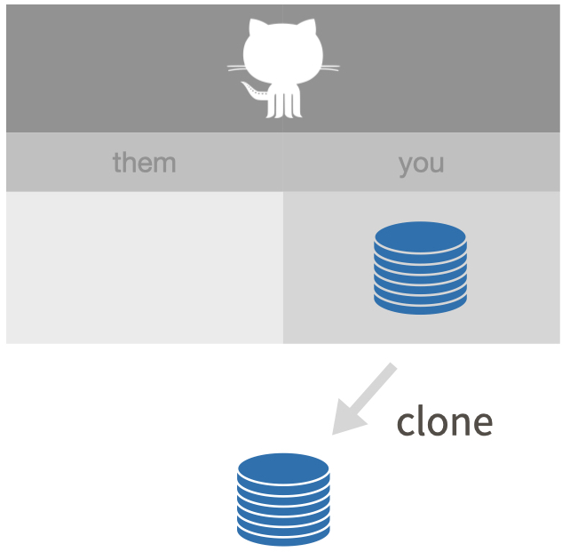

```{r}
#| echo = FALSE, fig.align = "center", out.width = "60%",
#| fig.alt = "Clone a remote repo."

```

I present two ways to do this:

* `usethis::create_from_github()`
* Via the RStudio IDE

*(Recall that we showed how to do this with command line Git in chapter \@ref(push-pull-github).)*

When you are cloning your own GitHub repository, the two methods are equivalent.
In other scenarios, especially fork-and-clone (chapter \@ref(fork-and-clone)), I think `usethis::create_from_github()` is superior, because it does additional, recommended setup.

Pick **one** of these methods below.

### `usethis::create_from_github()`

You can execute these commands in any R session.
If you use RStudio, then do this in the R console of any RStudio instance.

```{r eval = FALSE}
usethis::create_from_github(
  "https://github.com/YOU/YOUR_REPO.git",
  destdir = "~/path/to/where/you/want/the/local/repo/"
)
```

The first argument is `repo_spec` and it accepts the GitHub repo specification in various forms.
In particular, you can paste the URL we just copied from GitHub.

The `destdir` argument specifies the parent directory where you want the new folder (and local Git repo) to live.
If you don't specify `destdir`, usethis defaults to some very conspicuous place, like your desktop.
If you like to keep Git repos in a certain folder on your computer, you can personalize this default by setting the `usethis.destdir` option in your `.Rprofile`.

We're accepting the default behaviour of two other arguments, `rstudio` and `open`, because that's what most people will want.
For example, for an RStudio user, `create_from_github()` does this:

  * Creates a new local directory in `destdir`, which is all of these things:
    - a directory or folder on your computer
    - a Git repository, linked to a remote GitHub repository
    - an RStudio Project
  * Opens a new RStudio instance in the new Project
  * **In the absence of other constraints, I suggest that all of your R projects have exactly this set-up.**

### RStudio IDE

In RStudio, start a new Project:

  * *File > New Project > Version Control > Git*. In the "repository URL" paste
    the URL of your new GitHub repository. It will be something like this
    `https://github.com/jennybc/myrepo.git`.
  * Be intentional about where you create this Project.
  * I suggest you "Open in new session".
  * Click "Create Project" to create a new directory, which will be all of these things:
    - a directory or "folder" on your computer
    - a Git repository, linked to a remote GitHub repository
    - an RStudio Project
  * **In the absence of other constraints, I suggest that all of your R projects have exactly this set-up.**

This should download the `README.md` file that we created on GitHub in the previous step.
Look in RStudio's file browser pane for the `README.md` file.

Behind the scenes, RStudio has done this for you:

```console
git clone https://github.com/jennybc/myrepo.git
```
