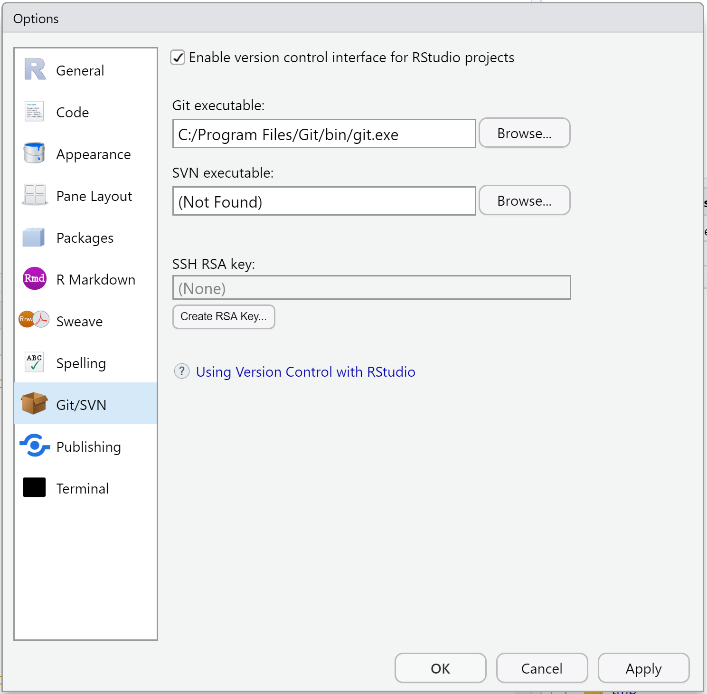

# Detect Git from RStudio {#rstudio-see-git}

If you want RStudio to help with your Git and GitHub work, it must be able to find the Git executable.

This usually "just works", so this page is aimed at people who have reason to suspect they have a problem.

This is something you set up once-per-computer.

## Do you have a problem?

Let's check if RStudio can find the Git executable.

  * *File > New Project...* Do you see an option to create from Version Control? If yes, good.
  * Select *New Directory* > *Empty Project*. Do you see a checkbox "Create a git repository"? If yes, good, CHECK IT.

Keep reading if things don't go so well or you want to know more.

## Find Git yourself

RStudio can only act as a GUI front-end for Git if Git has been successfully installed (chapter \@ref(install-git)) **AND RStudio can find it**.

A basic test for successful installation of Git is to simply enter `git` in the shell (Appendix \@ref(shell)).
If you get a complaint about Git not being found, it means installation was unsuccessful or that it is not being found, i.e. it is not on your `PATH`.

If you are not sure where the Git executable lives, try this in a shell:
  
* `which git` (Mac, Linux, Git Bash shell on Windows)

* `where git` (Windows command prompt, i.e. `cmd.exe`)

## Tell RStudio where to find Git

If Git appears to be installed and findable, launch RStudio.
Quit and re-launch RStudio if there's **any doubt in your mind** about whether you opened RStudio before or after installing Git.
Don't make me stop this car and restart RStudio for you in office hours.
DO IT.

From RStudio, go to *Tools > Global Options > Git/SVN* and make sure that the box *Git executable* points to your Git executable.

On macOS and Linux, the path usually looks something like this:

```console
/usr/bin/git
```

If you need to set this on macOS, it can sometimes be hard to navigate to the necessary directory, once you've clicked "Browse" and are working with a Finder-type window.
The keyboard shortcut "command + shift + g" will summon "Go To Folder", where you will be able to type or paste any path you want.

On Windows, this path should look something like this:

``` bash
C:/Program Files/Git/bin/git.exe
```

and here is a screenshot on Windows:

```{r}
#| echo = FALSE, fig.align = "center", out.width = "100%",
#| fig.alt = "RStudio screenshot showing path to the Git executable"

```

**WARNING**: On Windows, do __NOT__ use `C:/Program Files/Git/cmd/git.exe`. `bin` in the path is GOOD YES!
`cmd` in the path is BAD NO!

**WARNING**: On Windows, do __NOT__ set this to `git-bash.exe`.
Something that ends in `git.exe` is GOOD YES! `git-bash.exe` is BAD NO!
  
**Restart RStudio if you make any changes here.**
Don't make me stop this car again and restart RStudio for you in office hours.
DO IT.

Re-do the steps at the top of the page to see if RStudio and Git are communicating now.

No joy?

  * I've seen this help: With your Project open, go to `Tools > Project Options...`. If available, click on "Git/SVN" and select "Git" in the Version control system dropdown menu. Answer "yes" to the "Confirm New Git Repository" pop up. Answer "yes" to the "Confirm Restart RStudio" pop up.

  * If you installed Git via GitHub for Windows, it is possible the Git executable is really well hidden. Get help or use one of [our recommended methods of installing Git](#install-git).

  * Your `PATH` is probably not set up correctly and/or you should re-install Git and control/notice where it's going. Read more in \@ref(troubleshooting).

  * Get our help.
