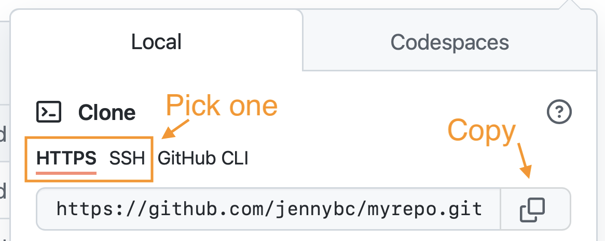

# Connect RStudio to Git and GitHub {#rstudio-git-github}

Here we verify that RStudio can issue Git commands on your behalf. 
Assuming that you've gotten local Git to talk to GitHub, this means you'll also be able to pull from and push to GitHub from RStudio.

In later chapters and in live workshops, we revisit these operations with much more explanation.

If you succeed here, your set up is DONE.

## Prerequisites

We assume the following: 

  * You've registered a free GitHub account (chapter \@ref(github-acct)).
  * You've installed/updated R and RStudio (chapter \@ref(install-r-rstudio)).
  * You've installed Git (chapter \@ref(install-git)).
  * You've introduced yourself to Git (chapter \@ref(hello-git)).
  * You've confirmed that you can push to / pull from GitHub from the command line (chapter \@ref(push-pull-github)).
  
You will also need a test repository on GitHub.

If you just completed the previous chapter, [Connect to GitHub], that will be perfect!
However, I encourage you to delete the *local* repository, so you can experience how we use RStudio to clone it and get a local copy.
Delete the folder corresponding to the local repo any way you like.
It's just a regular directory on your computer.
Here's how to do that in the shell, if current working directory is `myrepo`:

```console
cd ..
rm -rf myrepo/
```

If you don't have a suitable test repository on GitHub, follow the instructions in the next section.

## Make a repo on GitHub

Go to <https://github.com> and make sure you are logged in.

Near "Repositories", click the big green "New" button.
Or, if you are on your own profile page, click on "Repositories", then click the big green "New" button.

How to fill this in:

* Repository template: No template.
* Repository name: `myrepo` (or whatever you wish, we'll delete this soon anyway).
* Description: "testing my setup" (or whatever, but some text is good for the README).
* Public.
* Initialize this repository with: Add a README file.
  
Click the big green button that says "Create repository".
  
Now click the big green button that says "<> Code".

Copy a clone URL to your clipboard.
If you're taking our default advice, copy the HTTPS URL.
But if you're opting for SSH, then make sure to copy the SSH URL.

```{r}
#| echo = FALSE, fig.align = "center", out.width = "100%",
#| fig.alt = "Selecting an HTTPS vs SSH URL on GitHub"

```

## Clone the test GitHub repository to your computer via RStudio

In RStudio, start a new Project:

  * *File > New Project > Version Control > Git*. In "Repository URL", paste the URL of your new GitHub repository. It will be something like this `https://github.com/jennybc/myrepo.git`.
    - Do you NOT see an option to get the Project from Version Control? Restart RStudio and try again. Still no luck? Go to chapter \@ref(rstudio-see-git) for tips on how to help RStudio find Git.
  * Accept the default project directory name, e.g. `myrepo`, which coincides with the GitHub repo name.
  * Take charge of -- or at least notice! -- where the Project will be saved locally. A common rookie mistake is to have no idea where you are saving files or what your working directory is. Pay attention. Be intentional. Personally, I would do this in `~/tmp`.
  * I suggest you check "Open in new session", as that's what you'll usually do in real life.
  * Click "Create Project".

You should find yourself in a new local RStudio Project that represents your test repo on GitHub.
This should download the `README.md` file from GitHub.
Look in RStudio's file browser pane for the `README.md` file.

## Make local changes, save, commit

From RStudio, modify the `README.md` file, e.g., by adding the line "This is a line from RStudio". Save your changes.

Commit these changes to your local repo. How?

From RStudio:

  * Click the "Git" tab in upper right pane.
  * Check "Staged" box for `README.md`.
  * If you're not already in the Git pop-up, click "Commit".
  * Type a message in "Commit message", such as "Commit from RStudio".
  * Click "Commit".

## Push your local changes online to GitHub
  
Click the green "Push" button to send your local changes to GitHub.

You should not experience a credential challenge, since one of the pre-requisites was successfully pushing to GitHub from the command line (chapter \@ref(push-pull-github)).
RStudio's Git pane just exposes a specific subset of command line Git and therefore once your credentials work in the shell, they should work in RStudio.
If you do experience a credential challenge, that suggests you should have a look at the troubleshooting suggestions for your chosen protocol, either [HTTPS](#pat-troubleshooting) or [SSH](#ssh-troubleshooting).

## Confirm the local change propagated to the GitHub remote

Go back to the browser.
I assume we're still viewing your new GitHub repo.

Refresh.

You should see the new "This is a line from RStudio" in the README.

If you click on "commits", you should see one with the message "Commit from RStudio".

If you have made it this far, you are DONE with set up.
Congratulations!

## Clean up

Quit the RStudio instance that's open to your test Project / Git repo.

Delete the local repo any way you like.
It's just a regular directory on your computer.

Here's how to do that in the shell, if current working directory is `myrepo`:

```console
cd ..
rm -rf myrepo/
```

In the browser, go to your repo's landing page on GitHub.
Click on "Settings".

Scroll down, click on "delete repository," and do as it asks.
