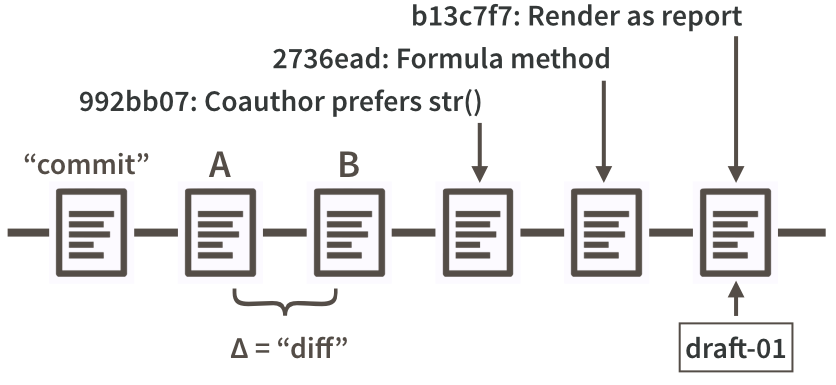

# Repo, commit, diff, tag {#git-basics}

## Repos or repositories

Git is a version control system whose original purpose was to help groups of
developers work collaboratively on big software projects. Git manages the
evolution of a set of files -- called a __repository__ or __repo__ -- in a highly structured way. Historically, these files would have consisted of source code and the instructions for how to build an application from its source.

Git has been re-purposed by the data science community [@Ram2013;
@git-for-humans; @ten-simple-rules-git]. We use it to manage the motley collection of files that make up typical data analytical projects, which consist of data, figures, reports, and, yes, some source code.

For new or existing projects, we recommand that you:

  * Dedicate a local directory or folder to it.
  * Make it an RStudio Project. *Optional but recommended; obviously only applies to projects involving R and users of RStudio.*
  * Make it a Git repository.
  
This setup happens once per project and can happen at project inception or at any later point. Chances are your existing projects each already live in a dedicated directory. Making such a directory an RStudio Project and Git repository boils down to allowing those applications to leave notes for themselves in hidden files or directories. The project is still a regular directory on your computer, that you can locate, name, move, and generally interact with as you wish. You don't have to handle it with special gloves!

The daily workflow is probably not dramatically different from what you do currently. You work in the usual way, writing R scripts or authoring reports in LaTeX or R Markdown. But instead of only *saving* individual files, periodically you make a __commit__, which takes a snapshot of all the files in the entire project. If you have ever versioned a file [by adding your initials or the date](http://www.phdcomics.com/comics/archive.php?comicid=1531), you have effectively made a commit, albeit only for a single file. It is a version that is significant to you and that you might want to inspect or revert to later. Periodically, you push commits to GitHub. This is like sharing a document with colleagues on DropBox or sending it out as an email attachment. By pushing to GitHub, you make your work and all your accumulated progress accessible to others.
  
This is a moderate change to your normal, daily workflow. It feels weird at first, but quickly becomes second nature. In [STAT 545](http://stat545.com) students are required to submit all coursework via GitHub, starting in week one. Most have never seen Git before and do not identify as programmers. It is a major topic in class and office hours for the first two weeks. Then we practically never discuss it again.

## Commits, diffs, and tags

We now connect the fundamental concepts of Git to the data science workflow:

  * repository
  * commit
  * diff

Recall that a repository or repo is just a directory of files that Git manages holistically. A commit functions like a snapshot of all the files in the repo, at a specific moment. Under the hood, that is not exactly how Git implements things. Although mental models don't have to be accurate in order to be useful, in this case it helps to align the two.

```{r commit-diff-sha-tag, echo = FALSE, out.width = "100%", fig.cap="\\label{fig:commit-diff-sha-tag}Partial commit history for our iris example, highlighting diffs, commit messages, SHAs, and tags."}

```

Figure \ref{fig:commit-diff-sha-tag} is a look at a fictional analysis of the iris data, focusing on the evolution of a script, `iris.R`. Consider version A of this file and a modified version, version B. Assume that version A was part of one Git commit and version B was part of the next commit. The set of differences between A and B is called a "diff" and Git users contemplate diffs a lot. Diff inspection is how you re-explain to yourself how version A differs from version B. Diff inspection is not limited to adjacent commits. You can inspect the diffs between any two commits.

In fact, Git's notion of any specific version of `iris.R` is as an accumulation of diffs. If you go back far enough, you find the commit where the file was created in the first place. Every later version is stored by Git as that initial version, plus all the intervening diffs in the history that affect the file. We'll set these internal details aside now, but understanding the importance of these deltas will make Git's operations less baffling in the long run.

So, by looking at diffs, it's easy to see how two snapshots differ, but what about the why?

Every time you make a commit you must also write a short __commit message__. Ideally, this conveys the motivation for the change. Remember, the diff will show the content. When you revisit a project after a break or need to digest recent changes made by a colleague, looking at the __history__, by reading commit messages and skimming through diffs, is an extremely efficient way to get up to speed. Figure \ref{fig:commit-diff-sha-tag} shows the messages associated with the last three commits.

Every commit needs some sort of nickname, so you can identify it. Git does this automatically, assigning each commit what is called a SHA, a seemingly random string of 40 letters and numbers (it is not, in fact, random but is a SHA-1 checksum hash of the commit). Though you will be exposed to these, you don't have to handle them directly very often and, when you do, usually the first 7 characters suffice. The commit messages in Figure \ref{fig:commit-diff-sha-tag}  are prefixed by such truncated SHAs. You can also designate certain snapshots as special with a __tag__, which is a name of your choosing. In a software project, it is typical to tag a release with its version, e.g., "v1.0.3". For a manuscript or analytical project, you might tag the version submitted to a journal or transmitted to external collaborators. Figure \ref{fig:commit-diff-sha-tag} shows a tag, "draft-01", associated with the last commit.
