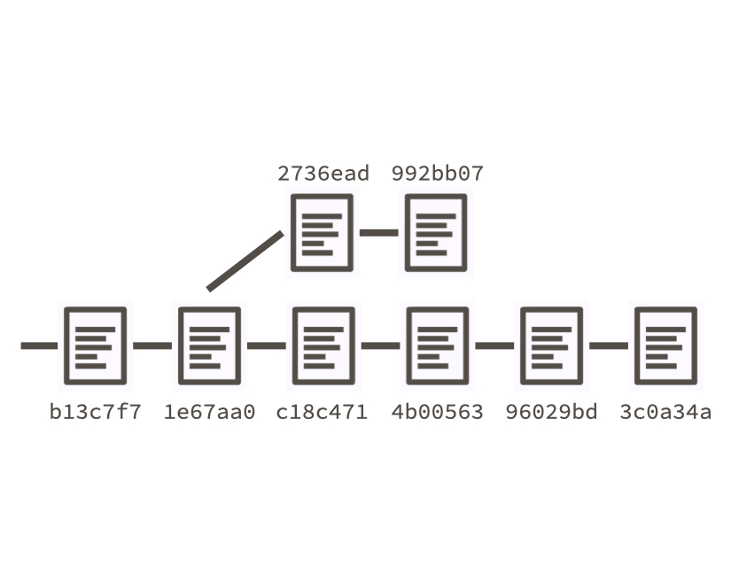
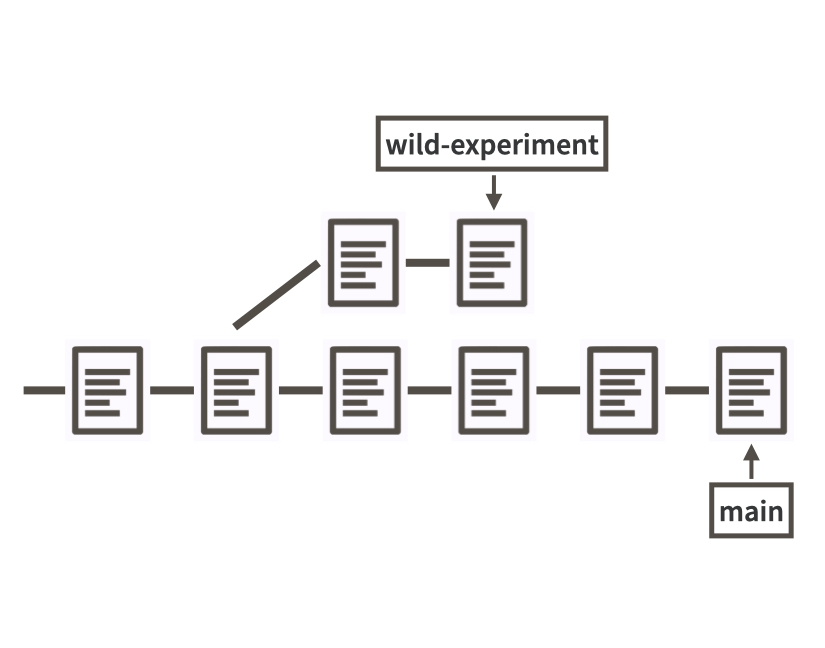
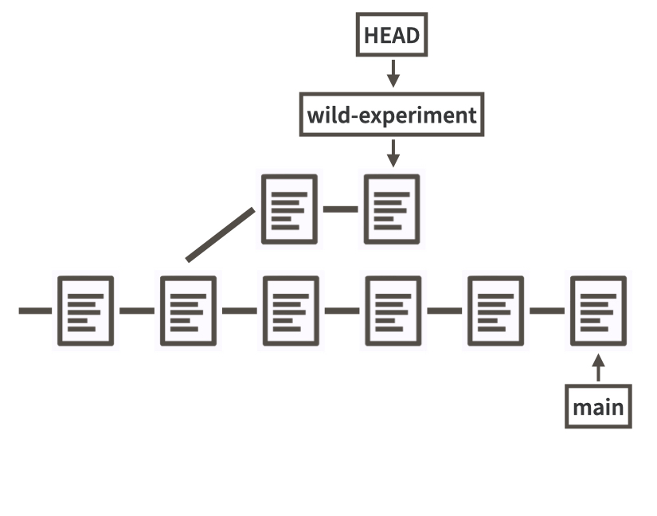
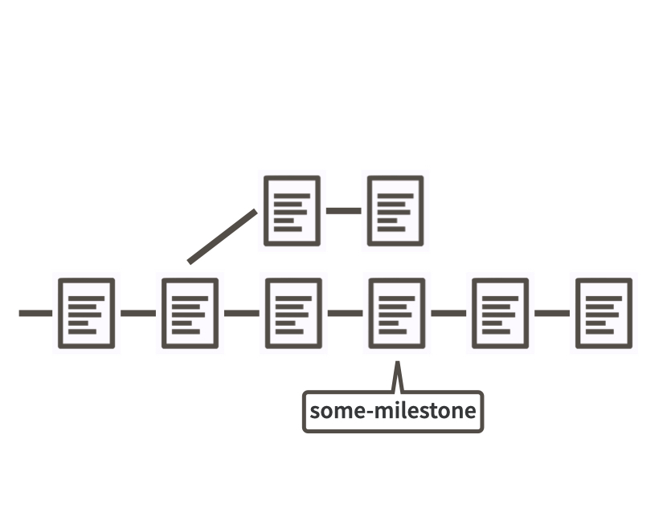
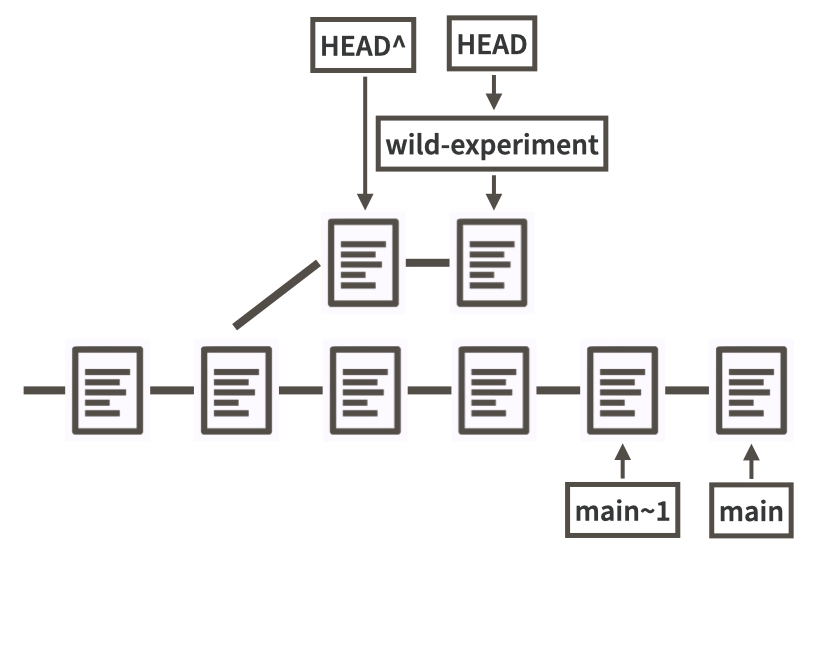
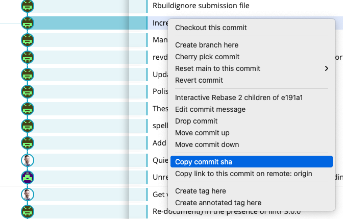
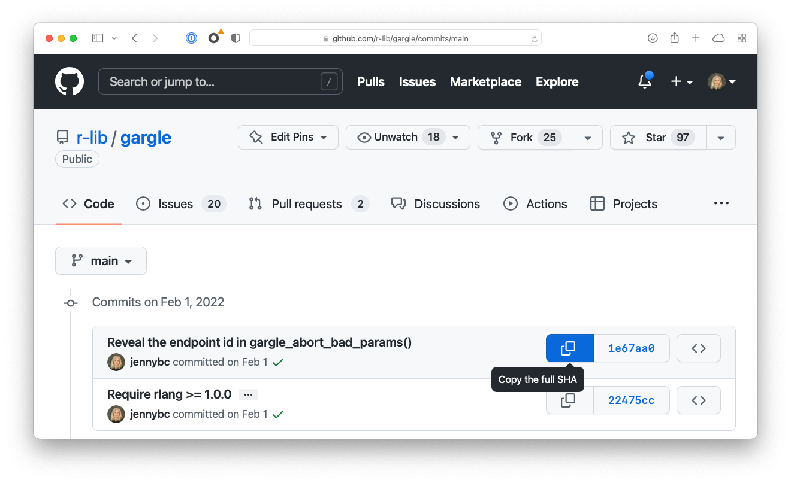

# Refs {#git-refs}

Many extremely useful Git workflows require you to identify a specific point in your repo's history, i.e. a specific commit.

We've explained elsewhere that every commit is associated with a so-called SHA, i.e. a SHA-1 checksum of the commit itself.
These opaque strings of 40 letters and numbers are not particularly pleasant for humans to work with.
The entry-level coping strategy is to work with an abbreviated form of the SHA.
It's typical to only use the first 7 characters, as this almost always uniquely identifies a commit.

```{r}
#| echo = FALSE, fig.align = "center", out.width = "60%",
#| fig.alt = "Git history annotated with SHAs."

```

Luckily, there are even more ways to talk about a specific commit, that are much easier for humans to wrap their head around.
These are called Git "refs", short for references and, if you're familiar with the programming concept of a pointer, that's exactly the right mental model.

## Useful refs

Here are some of the most useful refs:

* A branch name.
  Example: `main`, `wild-experiment`.
  When you refer to the `main` branch, that resolves to the SHA of the tip of
  the `main` branch.
  Think of a branch ref as a sliding ref that evolves as the branch does.
  
```{r}
#| echo = FALSE, fig.align = "center", out.width = "60%",
#| fig.alt = "Git history annotated with two branches."

```

* `HEAD`.
  This (almost always) resolves to the tip of the branch that is currently
  checked out.[^HEAD-no-branch]
  You can think of `HEAD` as a ref that points to the tip of the current branch,
  which itself is a ref, that points to a specific SHA.
  There are two layers of indirection.
  This is also called a *symbolic ref*.
  
```{r}
#| echo = FALSE, fig.align = "center", out.width = "60%",
#| fig.alt = "Git history annotated with HEAD symbolic ref."

```  
  
* A tag.
  Example: `v1.4.2`.
  Tags differ from branch refs and the `HEAD` ref in that they tend to be much
  more static.
  Tags aren't sliding by nature, although it is possible to reposition a tag to
  point at a new SHA, if you make an explicit effort.
  The most common use of a tag is to provide a nice label for a specific SHA.

```{r}
#| echo = FALSE, fig.align = "center", out.width = "60%",
#| fig.alt = "Git history annotated with a tag."

```  

[^HEAD-no-branch]: When does `HEAD` not resolve to the SHA at the tip of some branch?
When you are a *detached HEAD* state.
Detached HEAD!
That sounds bad, but it's not intrinsically good or bad.
It IS bad, though, to be in a detached HEAD state if you didn't mean to be and you don't understand the deal.
You get into a detached HEAD state when you directly checkout a specific commit, as opposed to checking out or switching to a *branch*.
In experienced hands, this can be a legit thing to do.
But in the meantime, I recommend that you always visit a specific state in the history by checking out a *branch*, even if that means you need to create a temporary branch like `holder` or `time-travel`.
To get out of the detached `HEAD` state, checkout some existing branch, with `git checkout main` or similar.
Otherwise, the StackOverflow thread [How do I fix a Git detached head?](https://stackoverflow.com/q/10228760) addresses many vexing detached `HEAD` scenarios.

If you'd like to make all of this more concrete, you can use `git rev-parse` in the shell to witness how refs resolve to concrete SHAs.
Here's the general pattern:

```console
git rev-parse YOUR_REF_GOES_HERE
```

Here are some examples executed in the Happy Git repo:

```console
~/rrr/happy-git-with-r % git rev-parse HEAD
631fee855db49d87f6c2a2cab474e89c11322bf4

~/rrr/happy-git-with-r % git rev-parse main
631fee855db49d87f6c2a2cab474e89c11322bf4

~/rrr/happy-git-with-r % git rev-parse testing-something                       
1eeb91d177b7cb5f9a0b29ebee3e6c0c8ff98f88
```

Notice that `HEAD` and `main` resolve to the same SHA, since the `main` branch was checked out at the time.
`testing-something` is the name of a branch that happened to be lying around.

These refs can be used in all sorts of Git operations, such as `git diff`, `git reset`, and `git checkout`:

```console
git diff main testing-something

git reset testing-something -- README.md

git checkout -b my-new-branch main
```

## Relative refs

There are also modifiers that help you specify a commit relative to a ref, e.g. "the commit just before this one".

`HEAD~1` refers to the commit just before `HEAD`.
`HEAD^` is another way to say exactly the same thing.

```{r}
#| echo = FALSE, fig.align = "center", out.width = "60%",
#| fig.alt = "Git history annotated with relative refs."

```  

Here are some examples executed in the Happy Git repo:

```console
~/rrr/happy-git-with-r % git rev-parse HEAD~1
5dacec4950a3746310bb30704417a792302b044a

~/rrr/happy-git-with-r % git rev-parse HEAD^
5dacec4950a3746310bb30704417a792302b044a
```

Notice that `HEAD~1` and `HEAD^` resolve to the same SHA.

Both of these patterns generalize.
`HEAD~3` and `HEAD^^^` are valid and equivalent refs.

I must admit that I am not a big fan of these relative ref shortcuts and especially not when reaching back more than one commit.
I worry that I have some sort of off-by-one error in my understanding and I'll end up targetting the wrong commit.

Tools like GitKraken and GitHub make it extremely easy to copy specific SHAs to your clipboard.
So when I need a ref that's not a simple branch name or tag, I almost always lean on user-friendly tools like GitKraken or GitHub to allow me to state my intent using the actual SHA of interest.
I suspect that the relative ref shortcuts are most popular with folks who are exclusively using command line Git and are operating under different constraints.
There's actually a rich set of ways to specify a target commit that goes well beyond the `^` and `~` syntax shown here.
You can learn more in the [official Git documention about revision parameters](https://git-scm.com/docs/gitrevisions).

In GitKraken, right or control click on the target commit to access a menu that includes "Copy commit sha", among many other useful commands.
If you're using another Git client, there is probably a way to do this and it's worth figuring that out.

```{r}
#| echo = FALSE, fig.align = "center", out.width = "60%",
#| fig.alt = "GitKraken screenshot showing how to copy a specific SHA."

```  

GitHub also makes it extremely easy to copy a SHA in many contexts.
This screenshot shows just one example.
Once you start looking for this feature, you'll find it in many places on GitHub.

```{r}
#| echo = FALSE, fig.align = "center", out.width = "60%",
#| fig.alt = "GitHub screenshot showing how to copy a specific SHA."

```  
