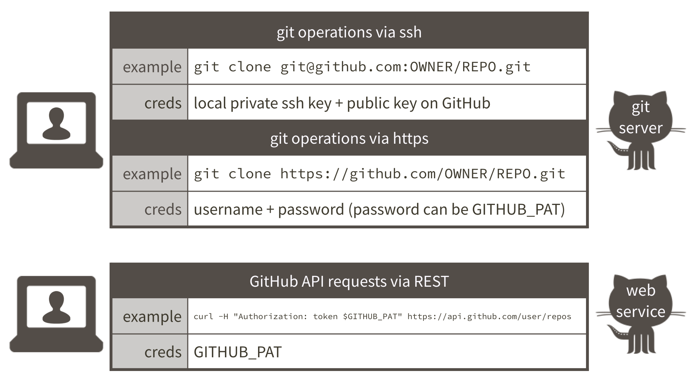

# GitHub Personal Access Tokens {#github-pat}

If you Git push or pull via the command line, you can avoid the constant authentication challenge by [caching your username and password](#credential-caching) for HTTPS access or by [setting up SSH keys](#ssh-keys). This includes any Git operations done by RStudio on your behalf.

But for some operations you must call the [GitHub API](https://developer.github.com/v3/) (**A**pplication **P**rogramming **I**nterface). And this requires that you [authenticate yourself](https://developer.github.com/v3/#authentication) in a different way.

```{r git-via-ssh-or-https-github-api, echo = FALSE, out.width = "100%", fig.cap = "Ways to authenticate to GitHub's git server and API"}

```

## GitHub API

The first reason most people need GitHub API access is because they want to use the [`devtools`](https://cran.r-project.org/web/packages/devtools/index.html) package. It is popular for the `devtools::install_github()` function to install directly from GitHub. This is in contrast to installing a package from CRAN via `install.packages()`.

Why install from GitHub instead of CRAN?

  * The package is developed on GitHub and you prefer the development version because it has some features or bug fixes not yet on CRAN.
  * You contribute to or use R packages that are in private repositories on GitHub (or GitHub Enterprise). CRAN is not an option.
  * You want to use helper functions from `usethis` to manage your GitHub projects, including:
    * `usethis::create_from_github(fork = TRUE)` to fork and clone a GitHub repository.
    * The `usethis::pr_*()` family of functions (`pr_init()`, `pr_fetch()`, `pr_pull()`, `pr_push()`, etc.) to create, update, and locally review pull requests.
  
Other reasons to call the GitHub API include doing almost anything you might do in the browser, especially if you need to do it on a grand scale, i.e., create repositories or users or fetch data. I recommend the [`gh` package](https://github.com/gaborcsardi/gh) for this. Which you must install from GitHub!

## How do you authenticate yourself?

With access via API, what plays the role of the HTTPS username/password or SSH keys? For the GitHub API, we use a *personal access token* (PAT), which is a convention followed by many other APIs.

You will need to:

  * Obtain a PAT. This is done in the browser or with `usethis::browse_github_pat()`.
  * Store it so packages like `devtools` can find it and use it on your behalf. The path of least resistance is to define it in your `.Renviron` file as the environment variable named `GITHUB_PAT`.

## Step-by-step

### Create a PAT

The easiest way to create a GitHub PAT is with `usethis::browse_github_pat()`. You will be sent to the form to create a PAT, with reasonable default scopes pre-populated.

Alternatively, you can create a PAT by logging in to your GitHub account. Go to <https://github.com/settings/tokens>. "Generate new token". Give it a nickname that reminds you of the intended purpose, e.g., "devtools".

Pick scopes that confer the privileges you need. When in doubt, check the `repo` scope, which is required for typical `devtools` operations. There used to be a set of default scopes, but that no longer appears to be true.

After you click "Generate token", the token will be displayed. It's a string of 40 random letters and digits. This is the last time you will see it SO COPY IT TO THE CLIPBOARD. Leave this window open until you're done. If you somehow goof this up, just generate a new one and try again.

### Add your PAT to .Renviron

Put your PAT in your `.Renviron` file. Have a line that looks like this:

```
GITHUB_PAT=8c70fd8419398999c9ac5bacf3192882193cadf2
```

but with *your* PAT instead of mine. Don't worry, I've revoked this one! 

`.Renviron` is a hidden file that lives in your home directory. Not sure where that is? The easiest way to find and edit `.Renviron` is with a function from the **usethis** package. In R, do:

```{r eval = FALSE}
usethis::edit_r_environ()
```

Your `.Renviron` file should pop up in your editor.  Add your `GITHUB_PAT` as above, save and close it. 

Put a line break at the end!  If you’re using an editor that shows line numbers, there should be two lines, where the second one is empty.

If questioned, YES you do want to use a filename that begins with a dot `.`. Note that, by default, most dotfiles are hidden in the RStudio file browser, but `.Renviron` should always be visible.

Restart R (*Session > Restart R* in the RStudio menu bar), as environment variables are loaded from `.Renviron` only [at the start of an R session](http://stat.ethz.ch/R-manual/R-patched/library/base/html/Startup.html). Check that the PAT is now available like so:

```{r eval = FALSE}
Sys.getenv("GITHUB_PAT")
```

You should see your PAT print to screen. 

Now commands you run from the `devtools` package, which consults `GITHUB_PAT` by default, will be able to access private GitHub repositories to which you have access, and you can install them with `devtools::install_github('username/reponame')`.

## A note about security

Many R packages that access web services, such as [those maintained by
rOpenSci](http://ropensci.org/packages/), give the option of storing API "tokens" or "keys" as environment variables in your `.Renviron` file. These tokens and this file, should *never be committed to GitHub, stored in Dropbox, or on any other online service*. They should not appear in your code or code comments. This is one reason why this file is stored *outside* your project folder. These tokens can be used to access your accounts [and wreak all kinds of havoc](https://securosis.com/blog/my-500-cloud-security-screwup). If you mistakenly share your tokens, log into the relevant site via the browser, revoke the compromised token, and generate a new one.

## Why `.Renviron` instead of bash config?

**FAQ**: Why define this environment variable via `.Renviron` instead of in `.bash_profile` or `.bashrc`?*

Because there are many combinations of OS and ways of running R where the `.Renviron` approach "just works" and the bash stuff does not. When R is a child process of, say, Emacs or RStudio, you can't always count on environment variables being passed to R. Put them in an R-specific start-up file and save yourself some grief.
