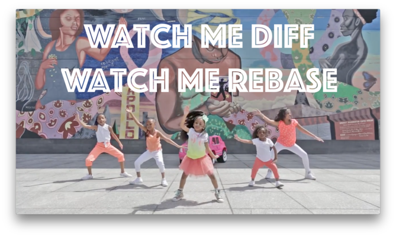

--- 
title: "Happy Git and GitHub for the useR"
author: "Jenny Bryan, the STAT 545 TAs, Jim Hester"
site: bookdown::bookdown_site
documentclass: book
bibliography: [book.bib, packages.bib]
biblio-style: apalike
link-citations: yes
github-repo: jennybc/happy-git-with-r
description: "Using Git and GitHub with R, Rstudio, and R Markdown"
twitter-handle: jennybryan
url: 'https\://happygitwithr.com/'
cover-image: img/watch-me-diff-watch-me-rebase-smaller.png
---

# Let's Git started {-}

<div class="figure">

<p class="caption">Still from <a href="https://www.youtube.com/watch?v=uBWrpVrazzA">Heaven King video</a></p>
</div>

Happy Git provides opinionated instructions on how to:

  * Install Git and get it working smoothly with GitHub, in the shell and in the [RStudio IDE](https://www.rstudio.com/products/rstudio/).
  * Develop a few key workflows that cover your most common tasks.
  * Integrate Git and GitHub into your daily work with R and [R Markdown](https://rmarkdown.rstudio.com).
  
The target reader is someone who uses R for data analysis or who works on R packages, although some of the content may be useful to those working in adjacent areas.

The first two parts, [Installation](#install-intro) and [Connect Git, GitHub, RStudio](#connect-intro), provide a "batteries included" quick start to verify your setup.

In [Early GitHub Wins](#usage-intro), we rack up some early success with the basic workflows that are necessary to get your work onto GitHub. We also show the special synergy between R/R Markdown/RStudio and GitHub, which provides a powerful demonstration of why all this setup is worthwhile.

The use of Git/GitHub in data science has a slightly different vibe from that of pure software development, due to differences in the user's context and objective. Happy Git aims to complement existing, general Git resources by highlighting the most rewarding usage patterns for data science. This perspective on the Git landscape is presented in [Basic Git Concepts](#git-intro) and [Daily Workflows](#workflows-intro). 

## License {-}

<a rel="license" href="http://creativecommons.org/licenses/by-nc/4.0/"></a><br /><span xmlns:dct="http://purl.org/dc/terms/" property="dct:title">Happy Git and GitHub for the useR</span> by <a xmlns:cc="http://creativecommons.org/ns#" href="https://github.com/jennybc/happy-git-with-r" property="cc:attributionName" rel="cc:attributionURL">Jennifer Bryan</a> is licensed under a <a rel="license" href="http://creativecommons.org/licenses/by-nc/4.0/">Creative Commons Attribution-NonCommercial 4.0 International License</a>.

```{r include = FALSE}
# automatically create a bib database for R packages
knitr::write_bib(c(
  .packages(), 'bookdown', 'knitr', 'rmarkdown'
), 'packages.bib')
```
