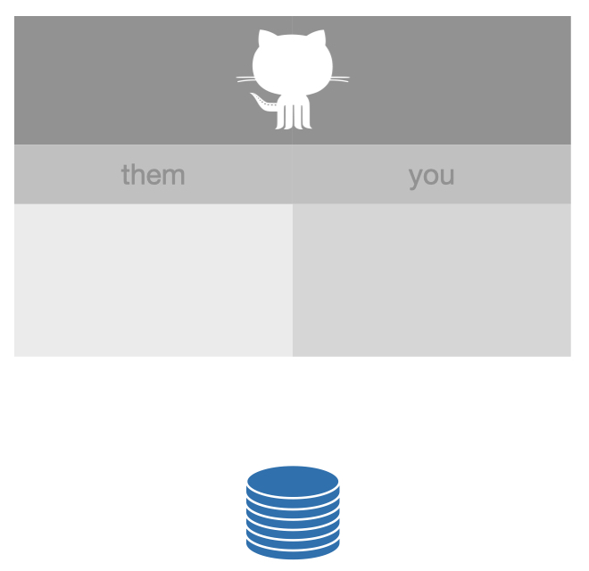
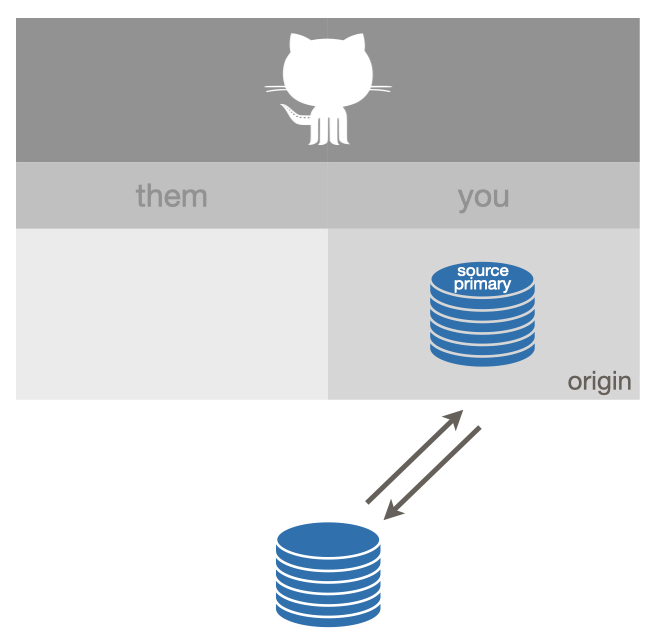
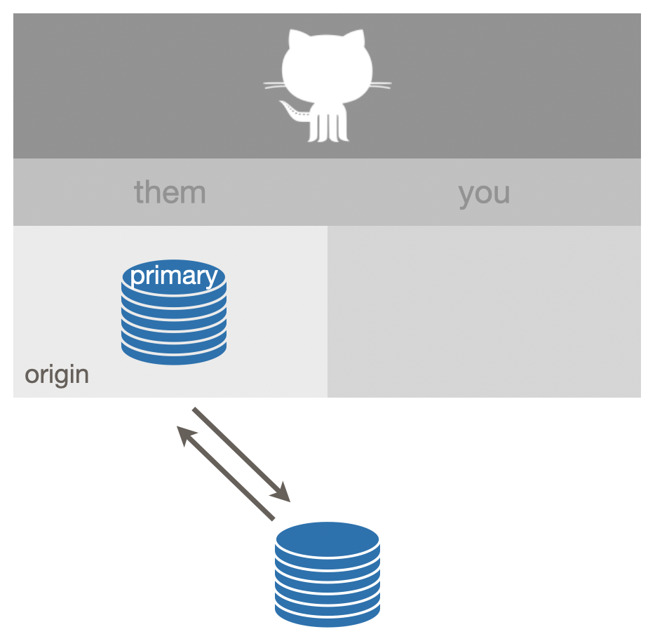
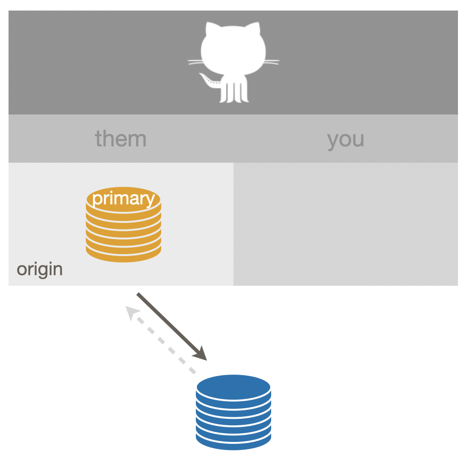
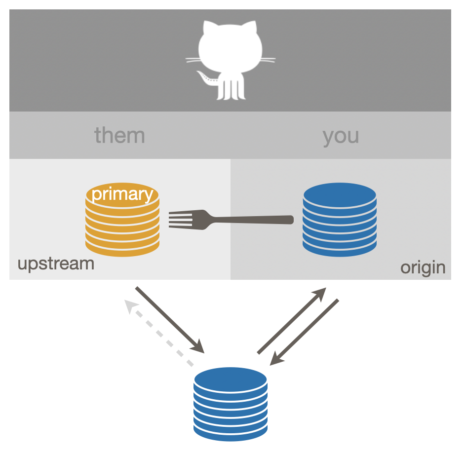
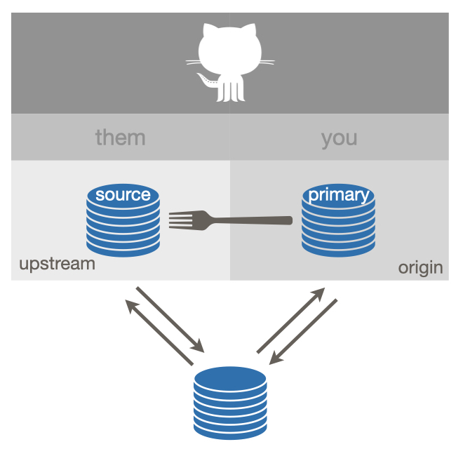
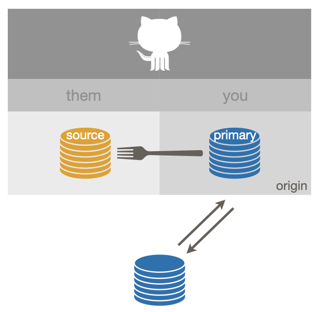

# Common remote setups {#common-remote-setups}

We only consider a very constrained set of remotes here:

* The remote is on GitHub, e.g. its URL looks something like `https://github.com/OWNER/REPO.git` or `git@github.com:OWNER/REPO.git`.
* The remote is named `origin` or `upstream`. These may not be the most evocative names in the world, but they are the most common choices.

If you use a different host or different remote names, you should still be able to translate these examples to your setting.

Along the way, we note how these setups relate to the usethis package, i.e. how usethis can help you get into a favorable setup or how a favorable setup unlocks the full power of usethis.
Many of these operations -- including characterizing your GitHub remotes -- require that you have configured a GitHub personal access token.
See section \@ref(get-a-pat) for more details on why and how to do that.
If you don't use usethis, feel free to ignore these asides.

## No GitHub

As a starting point, consider a local Git repo that is not yet connected to GitHub.

```{r no_github, echo = FALSE, out.width = "60%"}

```

This is not very exciting, but sets the stage for what's to come. We introduce the icon we use for a Git repo, which looks like a stack of coins or a barrel. This one is blue, which indicates you have write permission.

How to achieve:

  * Command line Git: `git init`
  * With usethis, existing project: `usethis::use_git()`
  * With RStudio:
    - Existing Project: *Tools > Version Control > Project Setup*, select Git
      as the version control system
    - New Project: Make sure "Create a Git repository" is selected
  
usethis describes this setup as "no_github".

## Ours (more specifically, yours) {#ours-you}

A common next step is to associate a local repo with a copy on GitHub, owned by you.

```{r ours-you, echo = FALSE, out.width = "60%"}

```

A remote named `origin` is configured and you have permission to push to (and pull from) `origin`.
(That's why `origin` is colored blue and there are solid arrows going both directions.)
The `origin` remote on GitHub is what we'll call a **source** repo, meaning it is not a fork (i.e. copy) of anything else on GitHub.
In this case, `origin` is also what we'll call your **primary** repo, meaning it is the primary remote you interact with on GitHub (for this project).

How to achieve if the local repo exists first:

  * With usethis: `usethis::use_github()`
  * Command line Git or RStudio: You can't complete this task fully from the
    command line or from RStudio:
    - Create a new GitHub repo in the browser, with the correct name,
      and capture its HTTPS or SSH URL
    - Command line: `git remote add origin <URL>`
    - In RStudio, click the *New Branch* button, which brings up a
      window where you can create the `origin` remote with this URL. This
      workflow is described in
      [Existing project, GitHub last](#existing-github-last).
    - Even now, the setup may not be ideal, because upstream tracking
      relationships are probably not setup, which means you may not be able to
      push and pull easily. You may need to explicitly configure an upstream
      tracking branch for one or more local branches. Next time you want to
      create a GitHub repo from a local repo, consider using
      `usethis::use_github()`, which completes all of this setup in one go.
    
How to achieve if the remote repo exists first:

  * With usethis: `usethis::create_from_github("OWNER/REPO", fork = FALSE)`
  * Command line: `git clone <URL>`, with the source repo's HTTPS or SSH URL
  * In RStudio: Capture the source repo's HTTPS or SSH URL and do
    *File > New Project > Version Control > Git*, described more fully in
    [New RStudio Project via git clone](#new-rstudio-project-via-git)
  
usethis describes this setup as "ours".

## Ours {#ours-them}

Here is a variation on "ours" that is equivalent in practice.

```{r ours-them, echo = FALSE, out.width = "60%"}

```

A remote named `origin` is configured and you can push to (and pull from) `origin`.
As above, `origin` is a **source** repo, meaning it is not a fork (or copy) of anything else on GitHub.
The `origin` remote is, however, not owned by you.
Instead it's owned by another GitHub user or organisation.
`origin` is also your **primary** repo in this setup.

How does this happen?

1. The source repo is owned by an organisation and your role in this organisation confers enough power to create repos or to push to this repo.
2. The owner of the source repo has added you, specifically, as a collaborator to this specific repo.

How to achieve? The procedure is the same as for the previous "ours" setup. But remember to specify `usethis::use_github(organisation = "ORGNAME")` if you want to create a new repo under an organisation, instead of your personal account.

usethis describes this setup as "ours".

## Theirs {#theirs}

This is a setup that many people get themselves into, when it's not actually what they need.
It's not broken *per se*, but it's limiting.

```{r theirs, echo = FALSE, out.width = "60%"}

```

You cannot push to `origin`, which is both the source repo and your primary repo.
(This is indicated by the orange color of `origin` and the greyed out, dashed "push" arrow.)
`origin` is read-only for you.

If you are taking a repo for a quick test drive, this configuration is fine.
But there is no way to get changes back into the source repo, since you cannot push to it and you haven't created a fork, which is necessary for a pull request.

How does this happen?

* Cloning the source repo, either via `git clone <URL>` (command line) or through a Git client, e.g. RStudio's *File > New Project > Version Control > Git* workflow.
* Calling `usethis::create_from_github("OWNER/REPO", fork = FALSE)`.

usethis describes this setup as "theirs".

What if you do want to make a pull request?
This means you should have done *fork-and-clone* instead of *clone*.
If you've made no changes or they're easy to save somewhere temporarily, just start over with a fork-and-clone workflow (see below) and re-introduce your changes.
It is also possible to preserve your work in a local branch, fork the source repo, re-configure your remotes, re-sync up with the source repo, and get back on track.
But this is much easier to goof up.
And remember to use `usethis::create_from_github(fork = TRUE)` in the future!

## Fork (of theirs) {#fork-them}

This is an ideal setup if you want to make a pull request and generally follow the development of a source repo owned by someone else.

```{r fork-them, echo = FALSE, out.width = "60%"}

```

This shows a successful "fork-and-clone".
Your local repo can pull changes from the source repo, which is configured as `upstream`, which you cannot push to (but you can pull from).
You have a fork of the source repo (a very special copy, on GitHub) and it is configured as `origin`.
`origin` is your primary repo.
You can push to and pull from `origin`.
You can make a pull request back to the source repo via your fork.

usethis describes this setup as "fork".

How to achieve:

  * With usethis: `usethis::create_from_github("OWNER/REPO", fork = TRUE)`
  * Command line Git or RStudio: You can't complete this task fully from the
    command line or RStudio:
    - Fork the source repo in the browser, capture the HTTPS or SSH
      URL of **your fork**, then use `git remote clone <FORK_URL>`
      (command line) or RStudio's *File > New Project > Version Control > Git*
      workflow. But, wait, you're not done! If you stop here, you will have the
      incomplete setup we refer to as
      ["fork (salvageable)"](#fork_upstream_is_not_origin_parent), below.
    - You still need to add the source repo as the `upstream` remote. Capture
      the HTTPS or SSH URL of the **source repo**. At the command line, do `git
      remote add upstream <SOURCE_URL>` or click RStudio's *New Branch* button,
      which brings up a window where you can add the `upstream` remote.
    - Even then, the setup may not be ideal, because your local default branch
      is probably tracking `origin`, not `upstream`, which is preferable for
      a fork. `usethis::create_from_github()` completes all of this setup in
      one go.

## Fork (of ours)

This is a less common variation on the fork setup.

```{r fork-ours, echo = FALSE, out.width = "60%"}

```

In this case, you have permission to push to the source repo, but you elect to create a personal fork anyway.
Certain projects favor this approach and it offers maximum development flexibility for advanced users.
However, most users are better served by the simpler "ours" setup in this case.

How to achieve:

  * In general, it's the same as the regular [fork setup](#fork-them) above.
  * With usethis, make sure to explicitly specify `fork = TRUE`, i.e. do
    `usethis::create_from_github("OWNER/REPO", fork = TRUE)`.
    
usethis describes this setup as "fork".
 
## Fork (salvageable) {#fork_upstream_is_not_origin_parent}

Here is one last fork setup that's sub-optimal, but it can be salvaged.

```{r fork-no-upstream, echo = FALSE, out.width = "60%"}

```

This is what happens when you do fork-and-clone and you *only* do fork-and-clone.
What's missing is a connection back to the source repo.

How does this happen?

* Cloning your own fork, either via `git clone` in the shell or through a Git client, such as RStudio. And then stopping here.

If you only plan to make one pull request, this setup is fine.
When the exchange is done, delete your local repo and your fork and move on with your life.
You can always re-fork in the future.
But if your pull request stays open for a while or if you plan to make repeated contributions, you'll need to pull ongoing developments in the source repo into your local copy.

Fix this by adding the source repo as your `upstream` remote.
Capture the HTTP or SSH URL of the **source repo** and then:

  * With usethis: `usethis::use_git_remote(name = "upstream", url = "SOURCE_URL")`
  * Command line Git: `git remote add upstream <SOURCE_URL>`
  * With RStudio: click the *New Branch* button, which brings up a window where
    you can add the `upstream` remote with this URL.

Even now, the setup may not be ideal, because your local default branch is probably tracking `origin`, not `upstream`, which is preferable for a fork.
Next time you do fork-and-clone, consider using `usethis::create_from_github(fork = TRUE)` instead, which completes all of this setup in one go.

usethis describes this setup as "fork_upstream_is_not_origin_parent".
