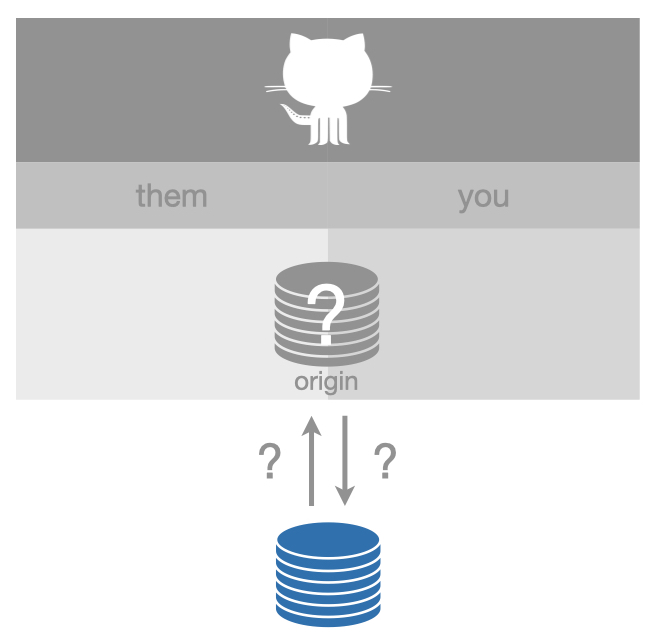
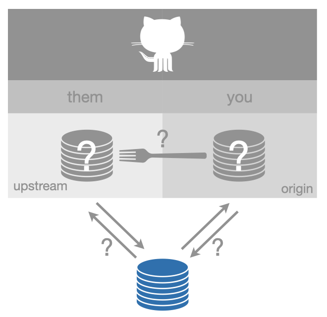

# Equivocal remote setups {#equivocal}

Just like the previous section about the most common setups, we only consider a very constrained set of remotes:

* The remote is on GitHub, e.g. its URL looks something like `https://github.com/OWNER/REPO.git` or `git@github.com:OWNER/REPO.git`.
* The remote is named `origin` or `upstream`.

The setups described here are characterized by *incomplete information*.
This section exists mostly to explain feedback that the usethis package might give about a GitHub remote configuration.

To identify any of the remote setups described in section \@ref(common-remote-setups), we need information from GitHub:

  * Whether you can push to a repo
  * Whether a repo is a fork
  * For a fork, what is its source repo

Sometimes some of this information is publicly available, but some of it never is, such as repo permissions.
This means that programmatic access to this information, i.e. requests to the GitHub API, generally requires authorization by an authenticated GitHub user.

This means that client packages, like usethis, work best when you have configured a GitHub personal access token (PAT).
See section \@ref(get-a-pat) for more details on why and how to do that.

If you've configured a PAT and are being told your GitHub config is problematic, consider these other explanations: Are you offline? Is GitHub down? Has your PAT expired? By default, they now expire after 30 days.

## Maybe "ours" or "theirs"

When we detect just one GitHub remote, but we can't verify the info above, usethis describes the setup as "maybe_ours_or_theirs".

```{r maybe_ours_or_theirs, echo = FALSE, out.width = "60%"}

```

Once a PAT is available, this setup can be identified as being ["ours" (belonging to you)](#ours-you), ["ours" (but belonging to someone else)](#ours-them), or ["theirs"](#theirs).

## Maybe fork

When we detect two GitHub remotes, but we can't verify the info above, usethis describes the setup as "maybe_fork".

```{r maybe_fork, echo = FALSE, out.width = "60%"}

```

Once a PAT is available, this setup can be identified as being a well-configured [fork](#fork-them) or a [fork with incomplete setup](#fork_upstream_is_not_origin_parent) (or possibly something more weird).

## How to fix

These setups aren't necessarily broken, but usethis needs more information to operate.

To "fix" this, set up a GitHub personal access token.
See section \@ref(get-a-pat) for more details on why and how to do that.

