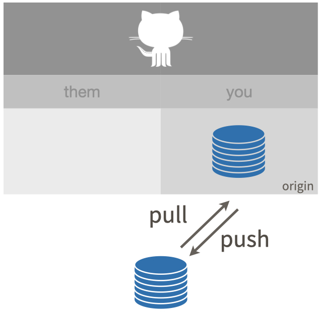

# New project, GitHub first {#new-github-first}

We create a new Project, with the preferred "GitHub first, then RStudio" sequence.
Why do we prefer this?
Because this method of copying the Project from GitHub to your computer also sets up the local Git repository for immediate pulling and pushing.
Under the hood, we are doing `git clone`.

You've actually done this before during set up (chapter \@ref(rstudio-git-github)).
We're doing it again, *with feeling*.

The workflow is pretty similar for other repository managers like GitLab or Bitbucket.
We will specify below when you may need to do something differently.

## Make a repo on GitHub

```{r echo = FALSE, results = "asis"}
dat <- list(
  repository_name_text = glue::glue("
    `myrepo` or whatever you wish to name your new project. Approach this \\
    similar to a variable name, in code: descriptive but brief, no \\
    whitespace. Letters, digits, `-`, `.`, or `_` are allowed."),
  description_text = glue::glue("
    \"Analysis of the stuff\" or any short description of the project. Write \\
    this for humans."),
  initialize_text = "Initialize this repository with: Add a README file."
)
insert <- glue::glue_data(
  dat,
  readr::read_file("child-create-a-github-repo.Rmd"),
  .open = "<<<", .close = ">>>"
)
res <- knitr::knit_child(text = insert, quiet = TRUE)
cat(res, sep = '\n')
```

### GitLab

Log in at <https://gitlab.com>.
Click on the "+" button in the top-right corner, and then on "New project".

- Project name: `myrepo` (or whatever you wish)  
- Public
- YES Initialize repository with a README

Click the big green button "Create project."

Copy the HTTPS or SSH clone URL to your clipboard via the blue "Clone" button.

### Bitbucket

Log in at <https://bitbucket.org>.
On the left-side pane, click on the "+" button, and then on "Repository" under "Create". 

- Repository name: `myrepo` (or whatever you wish)
- Access level: Uncheck to make the repository public.
- Include a README?: Select either "Yes, with a tutorial (for beginners)" or "Yes, with a template"
- Version control system: Git

Click the big blue button "Create repository."

Copy the HTTPS or SSH clone URL that appears when you click on the blue "Clone" button.
Make sure you remove the `git clone ...` that shows up at the beginning.

## New RStudio Project via git clone {#new-rstudio-project-via-git}

```{r echo = FALSE, results = "asis"}
text <- readr::read_file("child-create-a-github-repo.Rmd")
cat(res, sep = '\n')
```

### Have a look around

Regardless of whether you used usethis or RStudio, you should now be working in the new Git repo.
The implicit `git clone` should download the `README.md` file that we created on GitHub in the previous step.
Look in RStudio's file browser pane for the `README.md` file.

There's a big advantage to the "GitHub first, then RStudio" workflow: the remote GitHub repo is configured as the `origin` remote for your local repo and your local `main` branch is now tracking the `main` on GitHub.
This is a technical but important point about Git.
The practical implication is that you are now set up to push and pull.
No need to fanny around setting up Git remotes and tracking branches on the command line.

We're about to confirm we are setup for pulling and pushing.

```{r github-pull-push, echo = FALSE, out.width = "100%", fig.cap = "Pull and push."}

```


### Optional: peek under the hood

Completely optional activity: use command line Git to see what we're talking about above, i.e. the remote and tracking branch setup.

`git remote -v` or `git remote --verbose` shows the remotes you have setup.
Here's how that looks for someone using HTTPS with GitHub and calling it `origin`:

```console
~/tmp/myrepo % git remote -v
origin  https://github.com/jennybc/myrepo.git (fetch)
origin  https://github.com/jennybc/myrepo.git (push)
```

`git branch -vv` prints info about the current branch (`-vv` for "very verbose", I guess).
In particular, we can see that local `main` is tracking the `main` branch on `origin`, a.k.a. `origin/main`.

```console
~/tmp/myrepo % git branch -vv
* main 2899c91 [origin/main] A commit from my local computer
```

Finally, `git remote show origin` gives yet another view on useful remote and branch information:

```console
~/tmp/myrepo % git remote show origin    
* remote origin
  Fetch URL: https://github.com/jennybc/myrepo.git
  Push  URL: https://github.com/jennybc/myrepo.git
  HEAD branch: main
  Remote branch:
    main tracked
  Local branch configured for 'git pull':
    main merges with remote main
  Local ref configured for 'git push':
    main pushes to main (up to date)
```

`git clone`, which RStudio did for us, sets all of this up automatically.
This is why "GitHub first, then RStudio" is the preferred way to start projects early in your Git/GitHub life.

## Make local changes, save, commit

**Do this every time you finish a valuable chunk of work, probably many times a day.**

From RStudio, modify the `README.md` file, e.g., by adding the line "This is a line from RStudio".
Save your changes.

Commit these changes to your local repo. How?

  * Click the "Git" tab in upper right pane
  * Check "Staged" box for any files whose existence or modifications you want to commit.
    - To see more detail on what's changed in file since the last commit, click on "Diff" for a Git pop-up
  * If you're not already in the Git pop-up, click "Commit"
  * Type a message in "Commit message", such as "Commit from RStudio".
  * Click "Commit"

## Push your local changes to GitHub

**Do this a few times a day, but possibly less often than you commit.**

You have new work in your local Git repository, but the changes are not online yet.

This will seem counterintuitive, but first let's stop and pull from GitHub.

Why?
Establish this habit for the future!
If you make changes to the repo in the browser or from another machine or (one day) a collaborator has pushed, you will be happier if you pull those changes in before you attempt to push.
  
Click the blue "Pull" button in the "Git" tab in RStudio.
I doubt anything will happen, i.e. you'll get the message "Already up-to-date."
This is just to establish a habit.

Click the green "Push" button to send your local changes to GitHub.
RStudio will report something along these lines:

```console
>>> /usr/bin/git push origin HEAD:refs/heads/main
To https://github.com/jennybc/myrepo.git
   2899c91..b34cade  HEAD -> main
```

## Confirm the local change propagated to the GitHub remote

Go back to the browser.
I assume we're still viewing your new GitHub repo.

Refresh.

You should see the new "This is a line from RStudio" in the README.

If you click on "commits," you should see one with the message "Commit from RStudio".

## Make a change on GitHub

Click on README.md in the file listing on GitHub.

In the upper right corner, click on the pencil for "Edit this file".

Add a line to this file, such as "Line added from GitHub."

Edit the commit message in "Commit changes" or accept the default.

Click the big green button "Commit changes."

### GitLab

Click on README.md in the file listing on GitLab.

In the upper right corner, click on "Edit".

Add a line to this file, such as "Line added from GitLab."

Edit the commit message in "Commit changes" or accept the default.

Click the big green button "Commit changes."

### Bitbucket

Click on README.md in the file listing on Bitbucket.

In the upper right corner, click on "Edit".

Add a line to this file, such as "Line added from Bitbucket."

Click on the blue "Commit" button. A pop-up will show up. Edit the commit message or accept the default.

Click the blue "Commit" button.

## Pull from GitHub

Back in RStudio locally ...

Inspect your README.md.
It should NOT have the line "Line added from GitHub".
It should be as you left it.
Verify that.

Click the blue Pull button.

Look at README.md again.
You should now see the new line there.

## The end

```{r echo = FALSE, results = "asis"}
cat(readLines("child-the-end-of-repo-setup.Rmd"), sep = '\n')
```
