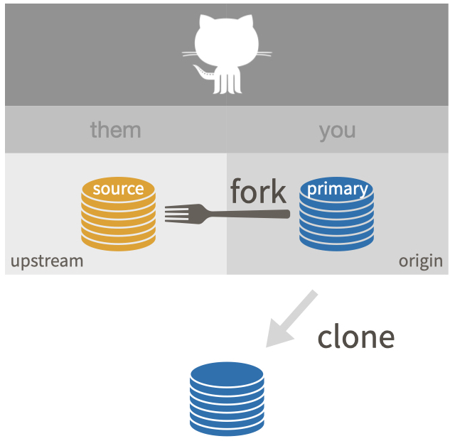
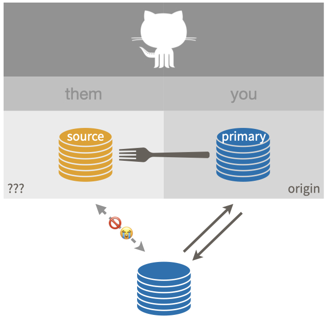
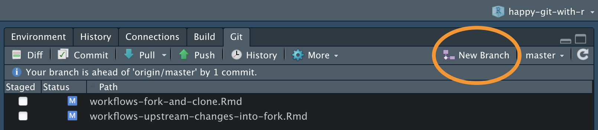
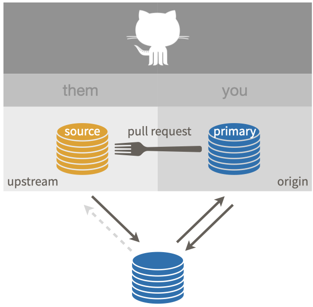

# Fork and clone {#fork-and-clone}

Use **fork and clone** to get a copy of someone else's repo if there's any chance you will want to propose a change to the owner, i.e. send a pull request.
If you are waffling between "just clone" and "fork and clone", go with "fork and clone".

We want to achieve this:

```{r}
#| echo = FALSE, fig.align = "center", out.width = "60%",
#| fig.alt = "Fork and clone."

```

Below we show a couple of methods for fork and clone and you should pick one:

* Use a combination of the browser, command line Git, and RStudio
* Via `usethis::create_from_github()`

Vocabulary: `OWNER/REPO` refers to what we call the **source** repo, owned by `OWNER`, who is not you.
`YOU/REPO` refers to your fork, i.e. your remote copy of the source repo, on GitHub.
This is the same vocabulary used elsewhere, such as the chapter on [common remote configurations](#common-remote-setups).

This is a good time to navigate to the [GitHub](https://github.com) repo of interest, i.e. the source repo `OWNER/REPO`.

## Fork and clone without usethis

I assume you're already visiting the source repo in the browser.
In the upper right hand corner, click **Fork**.

This creates a copy of `REPO` in your GitHub account and takes you there in the browser.
Now we are looking at `YOU/REPO`.

**Clone** `YOU/REPO`, which is your copy of the repo, a.k.a. your fork, to your local machine.
Make sure to clone your repo, not the source repo.
Elsewhere, we describe multiple methods for cloning a remote repo.
Pick one:

  * The [cloning instructions in Existing project, GitHub first](#git-clone-usethis-rstudio)
    cover usethis and RStudio.
  * The [cloning instructions in Connect to GitHub](#git-clone-command-line)
    show how to do this with command line Git.

Make a conscious decision about the local destination directory and HTTPS vs SSH URL.

### Finish the fork and clone setup {#fork-and-clone-finish}

If you stop at this point, you have what I regard as an incomplete setup, described elsewhere as ["fork (salvageable)"](#fork_upstream_is_not_origin_parent).

```{r}
#| echo = FALSE, fig.align = "center", out.width = "60%",
#| fig.alt = "Sad fork where `upstream` is not configured."

```

This is sad, because there is no direct connection between your local copy of the repo and the source repo `OWNER/REPO`.

There are two more recommended pieces of setup:

* Configure the source repo as the `upstream` remote
* Configure your local `main` branch (or whatever the default is) to track
  `upstream/main`, not `origin/main`
  
The nickname `upstream` can technically be whatever you want.
There is a strong tradition of using `upstream` in this context and, even though I have better ideas, I believe it is best to conform.
Every book, blog post, and Stack Overflow thread that you read will use `upstream` here.
Save your psychic energy for other things.
  
These steps make it easier for you to stay current with developments in the source repo.
We talk more below about why you should never commit to the default branch, e.g. `main`, when you're working in a fork (see \@ref(fork-dont-touch-main)).

### Configure the `upstream` remote {#fork-configure-upstream}

The first step is to get the URL of the **source** repo `OWNER/REPO`.
Navigate to the source repo on GitHub.
It is easy to get to from your fork, `YOU/REPO`, via the "forked from" link in the upper left.

Use the big green "Code" button to get the URL for `OWNER/REPO` on your clipboard.
Be intentional about whether you copy the HTTPS or SSH URL.

You can configure the `upstream` remote with command line Git, usethis, or RStudio.

Here's how to use command line Git in a shell:

``` bash
git remote add upstream https://github.com/OWNER/REPO.git
```

`usethis::use_git_remote()` allows you to configure a Git remote.
Execute this in R:

```{r, eval = FALSE}
usethis::use_git_remote(
  name = "upstream",
  url = "https://github.com/OWNER/REPO.git"
)
```

Finally, you can do this in RStudio, although it feels a bit odd.
Click on "New Branch" in the Git pane ("two purple boxes and a white square").

```{r}
#| echo = FALSE, fig.align = "center", out.width = "60%",
#| fig.alt = "RStudio's New Branch button."

```

This will reveal a button to "Add Remote".
Click it.
Enter `upstream` as the remote name and paste the URL for `OWNER/REPO` that you got from GitHub.
Click "Add".
Decline the opportunity to add a new branch by clicking "Cancel".

### Set upstream tracking branch for the default branch {#fork-set-upstream-tracking-main}

This is optional but highly recommended for most fork and clone situations.
We're going to set `upstream/main` from the source repo as the upstream tracking branch of local `main`.
(If your default branch has a different name, substitute accordingly.)

This is desirable so that a simple `git pull` pulls **from the source repo**, not from your fork.
It also means a simple `git push` will (attempt to) push to the source repo, which will almost always be rejected since you probably do not have permission.
This failure will alert you to the fact that you're doing something questionable, while it's still easy to back out.

First, fetch info for the `upstream` remote.
This is especially important if you just configured `upstream` for the first time.

``` bash
git fetch upstream
```

The two commands below do the same thing; the first is just shorthand for the second.
Do this with command line Git in a shell:

``` bash
git branch -u upstream/main
git branch --set-upstream-to upstream/main
```

If you found this fork and clone workflow long and tedious, consider using `usethis::create_from_github()` next time!

## `usethis::create_from_github("OWNER/REPO", fork = TRUE)` {#fork-and-clone-create-from-github}

The [usethis package](https://usethis.r-lib.org) has a convenience function, [`create_from_github()`](https://usethis.r-lib.org/reference/create_from_github.html), that can do "fork and clone" (as well as just clone).
The `fork` argument controls whether the source repo is cloned or fork-and-cloned.
Note that `create_from_github(fork = TRUE)` requires that you have [configured a GitHub personal access token](#https-pat).

I assume you're already visiting the source repo in the browser.
Now click the big green button that says "<> Code".
Copy a clone URL to your clipboard.
If you're taking our default advice, copy the HTTPS URL.
But if you're opting for SSH, then make sure to copy the SSH URL.

You can execute this next command in any R session.
If you use RStudio, then do this in the R console of any RStudio instance.
In either case, after successful completion, you should find yourself in the new project that is the local repo connected to your fork.

```{r eval = FALSE}
usethis::create_from_github(
  "https://github.com/OWNER/REPO",
  destdir = "~/path/to/where/you/want/the/local/repo/",
  fork = TRUE
)
```

The first argument is `repo_spec` and it accepts the GitHub repo specification in various forms.
In particular, you can use the URL we just copied for the source repo.

The `destdir` argument specifies the parent directory where you want the new folder (and local Git repo) to live.
If you don't specify `destdir`, usethis defaults to some very conspicuous place, like your desktop.
If you like to keep Git repos in a certain folder on your computer, you can personalize this default by setting the `usethis.destdir` option in your `.Rprofile`.

The `fork` argument specifies whether to clone (`fork = FALSE`) or fork and clone (`fork = TRUE`).
You often don't need to specify `fork` and can just enjoy the default behaviour, which is governed by your permissions on the source repo.
By default, `fork = FALSE` if you can push to the source repo and `fork = TRUE` if you cannot.

Here is what that might look like (note that we're accepting the default behaviour for many arguments):

```{r eval = FALSE}
usethis::create_from_github("https://github.com/OWNER/REPO")
#> ℹ Defaulting to 'https' Git protocol
#> ✔ Setting `fork = TRUE`
#> ✔ Creating '/some/path/to/local/REPO/'
#> ✔ Forking 'OWNER/REPO'
#> ✔ Cloning repo from 'https://github.com/YOU/REPO.git' into '/some/path/to/local/REPO'
#> ✔ Setting active project to '/some/path/to/local/REPO'
#> ℹ Default branch is 'main'
#> ✔ Adding 'upstream' remote: 'https://github.com/OWNER/REPO.git'
#> ✔ Pulling changes from 'upstream/main'.
#> ✔ Setting remote tracking branch for local 'main' branch to 'upstream/main'
#> ✔ Setting active project to '<no active project>'
```

For an RStudio user, `create_from_github(fork = TRUE)` does all of this:

* Forks the source repo on GitHub.
* Clones your fork to a new local repo (and RStudio Project).
  This configures your fork as the `origin` remote.
* Configures the source repo as [the `upstream` remote](#upstream-changes).
* Sets the upstream tracking branch for `main` (or whatever the default branch
  is) to `upstream/main`.
* Opens a new RStudio instance in the new local repo (and RStudio Project).

## Engage with the new repo

If you used `usethis::create_from_github()` or did fork and clone via [Existing project, GitHub first](#existing-github-first), you are probably in an RStudio Project for this new repo.

Regardless, get yourself into this project, whatever that means for you, using your usual method.

Explore the new repo in some suitable way.
If it is a package, you could run the tests or check it.
If it is a data analysis project, run a script or render an Rmd.
Convince yourself that you have gotten the code.

You should now be in the perfect position to sync up with ongoing developments in the source repo and to propose new changes via a pull request from your fork.

```{r}
#| echo = FALSE, fig.align = "center", out.width = "60%",
#| fig.alt = "Fork and clone, ideal setup."

```

You can use the commands below to review more of the nitty gritty Git details of your fork and clone setup:

* Command line Git in a shell:
  - `git remote -v`
  - `git remote show origin` (or `upstream`)
  - `git branch -vv`
* In R:
  - `usethis::git_remotes()`
  - `usethis::git_sitrep()`

In the shell, `git remote -v` should reveal that your remotes are configured like so:

``` bash
origin    https://github.com/YOU/REPO.git (fetch)
origin    https://github.com/YOU/REPO.git (push)
upstream  https://github.com/OWNER/REPO.git (fetch)
upstream  https://github.com/OWNER/REPO.git (push)
```

Comparable info is available In R with `usethis::git_remotes()`:

```{r eval = FALSE}
git_remotes()
#> $origin
#> [1] "https://github.com/YOU/REPO.git"
#> 
#> $upstream
#> [1] "https://github.com/OWNER/repo.git"
```

In the shell, with the default branch checked out, `git branch -vv` should reveal that `upstream/main` is the upstream tracking branch:

``` bash
~/some/repo/ % git branch -vv                   
* main 2739987 [upstream/main] Some commit message
```

All of this info about remotes and branches is also included in the rich information reported with `usethis::git_sitrep()`.

## Don't mess with `main` {#fork-dont-touch-main}

Here is some parting advice for how to work in a fork and clone and situation.

If you make any commits in your local repository, I **strongly recommend** that you work in [a new branch](#git-branches), not `main` (or whatever the default branch is called).

I **strongly recommend** that you do not make commits to `main` of a repo you have forked.
If you commit to `main` in a repo you don't own, it creates a divergence between that branch's history in the source repo and in your repo.
Nothing but pain will come from this.
(If you've already done this, we discuss how to fix the situation in [Um, what if I did touch `main`?](#touched-main).)

When you treat `main` as read-only, it makes life much easier when you want to [pull upstream work](#upstream-changes) into your copy.
The `OWNER` of `REPO` will also be happier to receive your pull request from a non-`main` branch.

For more detail, this Q&A on Stack Overflow is helpful: [Why is it bad practice to commit to your fork's master branch?](https://stackoverflow.com/q/33749832).
