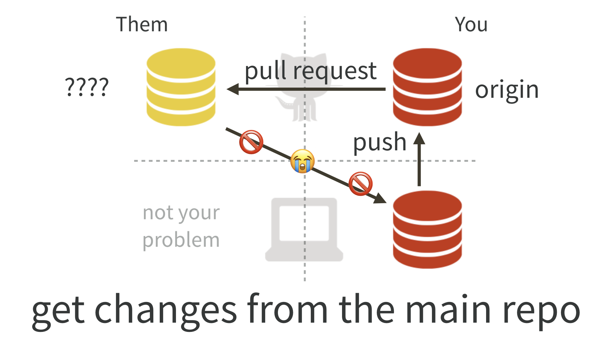

# Fork and clone {#fork-and-clone}

Use "fork and clone" to get a copy of someone else's repo if there's any chance you will want to propose a change to the owner, i.e. send a "pull request". If you are waffling between "clone" and "fork and clone", go with "fork and clone".

## Initial workflow

On [GitHub](https://github.com), make sure you are signed in and navigate to the repo of interest. Think of this as `OWNER/REPO`, where `OWNER` is the user or organization who owns the repository named `REPO`.

In the upper right hand corner, click **Fork**.

This creates a copy of `REPO` in your GitHub account and takes you there in the browser. Now we are looking at `YOU/REPO`.

**Clone** `YOU/REPO`, which is your copy of the repo, a.k.a. your fork, to your local machine. You have two options:

  * [Existing project, GitHub first](#existing-github-first), an RStudio workflow we've used before.
    - Your fork `YOU/REPO` plays the role of the existing GitHub repo, in this case -- not the original repo!
    - Make a conscious decision about the local destination directory and HTTPS vs SSH URL.
  * Execute `git clone https://github.com/YOU/REPO.git` (or `git clone git@github.com:YOU/REPO.git`) in the shell (Appendix \@ref(shell)).
    - Clone your fork `YOU/REPO`-- not the original repo!
    - `cd` to the desired parent directory first. Make a conscious decision about HTTPS vs SSH URL.
    
We're doing this:

    
## `usethis::create_from_github("OWNER/REPO")`

The [usethis package](https://usethis.r-lib.org) has a convenience function, [`create_from_github()`](https://usethis.r-lib.org/reference/create_from_github.html), that can do "fork and clone".
In fact, it goes even further and [configures the `upstream` remote](#upstream-changes) and sets the upstream tracking branch for `main` (or whatever the default branch is) to `upstream/main`.
Note that `create_from_github()` requires that you have [configured a GitHub personal access token](#https-pat).
It hides lots of detail and can feel quite magical.

Due to these difference, we won't dwell on `create_from_github()` here.
But once you get tired of doing all of this "by hand", check it out!

## Engage with the new repo

If you did "fork and clone" via [Existing project, GitHub first](#existing-github-first), you are probably in an RStudio Project for this new repo.

Regardless, get yourself into this project, whatever that means for you, using your usual method.

Explore the new repo in some suitable way. If it is a package, you could run the tests or check it. If it is a data analysis project, run a script or render an Rmd. Convince yourself that you have gotten the code.

## Don't mess with `master` {#dont-touch-master}

If you make any commits in your local repository, I **strongly recommend** that you work in [a new branch](#git-branches), not `master`.

I **strongly recommend** that you do not make commits to `master` of a repo you have forked.

This will make your life much easier if you want to [pull upstream work](#upstream-changes) into your copy. The `OWNER` of `REPO` will also be happier to receive your pull request from a non-`master` branch.

## The original repo as a remote

Remember we are here:

Here is the current situation in words:

  * You have a fork `YOU/REPO`, which is a repo on GitHub.
  * You have a local clone of your fork.
  * Your fork `YOU/REPO` is the remote known as `origin` for your local repo.
  * You are well positioned to make a pull request to `OWNER/REPO`.
  
But notice the lack of a direct connection between your local copy of this repo and the original `OWNER/REPO`. This is a problem.

As time goes on, the original repository `OWNER/REPO` will continue to evolve. You probably want the ability to keep your copy up-to-date. In Git lingo, you will need to get the "upstream changes".

See the workflow [Get upstream changes for a fork](#upstream-changes) for how to inspect your remotes, add `OWNER/REPO` as `upstream` if necessary, and pull changes, i.e. how to complete the "triangle" in the figure above.

### No, you can't do this via GitHub

You might hope that GitHub could automatically keep your fork `YOU/REPO` synced up with the original `OWNER/REPO`. Or that you could do this in the browser interface. Then you could pull those upstream changes into your local repo.

But you can't.

There are some tantalizing, janky ways to sort of do parts of this. But they have fatal flaws that make them unsustainable. I believe you really do need to [add `upstream` as a second remote on your repo and pull from there](#upstream-changes).
