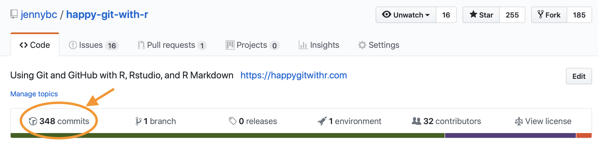
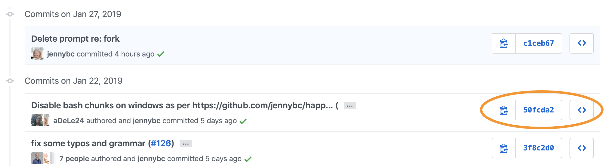
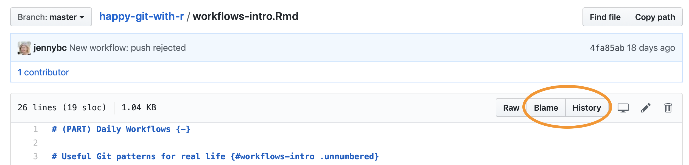
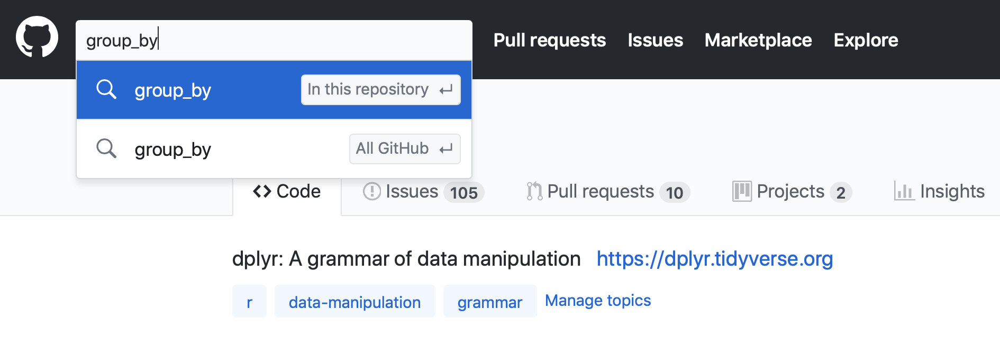

# Time travel: See the past {#time-travel-see-past}

<!-- http://www.commitstrip.com/en/2019/01/28/git-lfs/? -->

Sometimes you just need to **see** various files in your project as they were at some significant moment in the past. Examples:

  * "I liked the color scheme of this plot better in last week's draft". "What's up with that new funky outlier in figure 2?"
    - Here you'll want to visit scripts and source data as they were the last time you generated visualizations to share with this colleague.
  * "The build has been failing on Windows for two weeks."
    - Here you'll want to inspect package source at the "last known good" version and scrutinize subsequent commits.

All projects move through various states that you regard as "good" vs. "bad" or something in between. It can be useful to explore the past, when trying to get into a "good" state.

## Hyperlinks are awesome!

This is where GitHub (and GitLab or BitBucket) really shine. The ability to quickly explore different commits/states, switch between branches, inspect individual files, and see the discussion in linked issues is incredibly powerful.

Yes, technically, you can visit past states of your project using Git commands locally. But it is significantly more cumbersome. You generally have to checkout these previous states, which raises the prospect of getting comfortable in the "detached head" state and unintentionally making new commits on the wrong branch or on no branch at all.

GitHub's hyperlink-rich presentation of your repo and its history is one of the top reasons to sync local work to a copy on GitHub, even if you keep it private. It can be much easier to hone in on a state or change of interest by clicking around or using GitHub's search features. Also, because it is so clearly a remote and read-only action, there is no possibility of goofing up local state or committing new work to the wrong branch.

## Browse commit history and specific commits

From your repo's landing page, access commit history by clicking on "xyz commits". This is like using `git log` locally, but much more rewarding. If you have a good [local Git client](#git-client), it probably also provides a graphical overview of history.

```{r github-link-to-commit-listing, echo = FALSE, out.width = "100%", fig.cap = "Link to commit listing on GitHub."}

```

Once you're viewing the history, notice three ways to access more info for each commit:

  1. The clipboard icon copies the SHA-1 of the commit. This can be handy if you need to refer to this commit elsewhere, e.g. in an issue thread or a commit message or in a Git command you're forming for local execution.
  1. Click on the abbreviated SHA-1 itself in order to the view the diff associated with the commit.
  1. Click on the double angle brackets `<>` to browse the state of the entire repo at that point in history.

```{r github-commit-listing, echo = FALSE, out.width = "100%", fig.cap = "Example of a commit listing on GitHub."}

```

Back out of any drilled down view by clicking on `YOU/REPO` to return to your repo's landing page. This brings you back to the present state and top-level of your repo.

### Use hyperlinks yourself!

Once you've identified a relevant commit, diff, or file state, you can copy the current URL from your browser and use it to enhance online discussion elsewhere, i.e. to bring other people to this exact view of the repo. The hyperlink-iness of repos hosted on GitHub can make online discussion of a project much more precise and efficient.

## File driven inquiries

What if you're interested in how a specific file came to be the way it is? First navigate to the file, then notice "Blame" and "History" in the upper right.

```{r github-specific-file, echo = FALSE, out.width = "100%", fig.cap = "Visiting a specific file on GitHub."}

```

### Blame

The "blame" view of a file is related to what `git blame` does on the command line. It reveals who last touched each line of the file, how long ago, and the associated commit message. Click on the commit message to visit that commit. Or click the "stacked rectangles" icon to move further back in time, but staying in blame view. This is handy when doing forensics on a specific and small set of lines.

*add a screenshot (and update that above) but first pick a better example than Happy Git, i.e. one with more contributors / more interesting history*

### History

The "history" view for a file is very much like the overall commit history described above, except it only includes commits that affect the file of interest. This can be handy when your inquiry is rather diffuse and you're trying to digest the general story arc for a file.

### Hyperlink to specific lines at a specific state

When viewing a file on GitHub, you can click on a line number to highlight it. Use "click ... shift-click" to select a range of lines. Notice your browser's URL shows something of this form:

``` bash
https://github.com/OWNER/REPO/blob/SHA/path/to/file.R#L27-L31
```

If the URL does not contain the SHA, type "y" to toggle into that form.

These file- and SHA-specific URLs are a great way to point people at particular lines of code in online conversations. It's best practice to use the uglier links that contain the SHA, as they will stand the test of time.

## Search

Search is always available in the upper-righthand corner of GitHub.

```{r github-repo-search, echo = FALSE, out.width = "100%", fig.cap = "Typing into GitHub search bar."}

```

Once you enter some text in the search box, a dropdown provides the choice to search in the current repo (the default) or all of GitHub. GitHub searches the contents of files (described as "Code"), commit messages, and issues. Take advantage of the search hits across these different domains. Again, this is a powerful way to zoom in on specific lines of code, revisit an interesting time in project history, or re-discover a conversation thread.

### Issue search

If you want to search issues specifically, the search box on any repo's Issues page is prepopulated with the filters `is:issue` and `is:open`.

