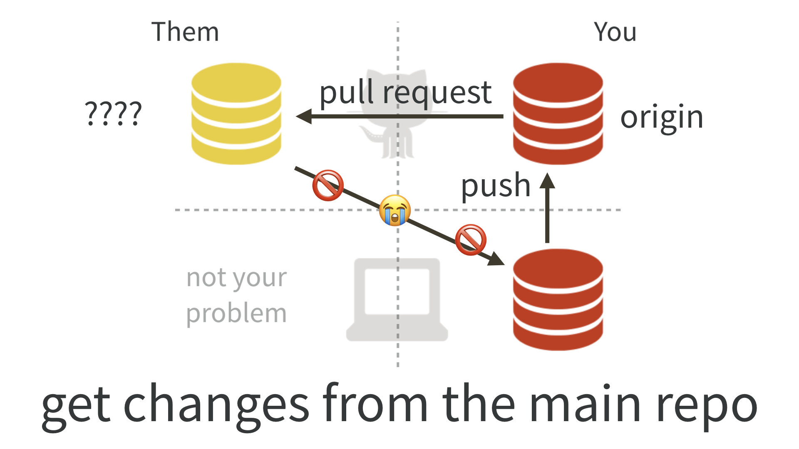
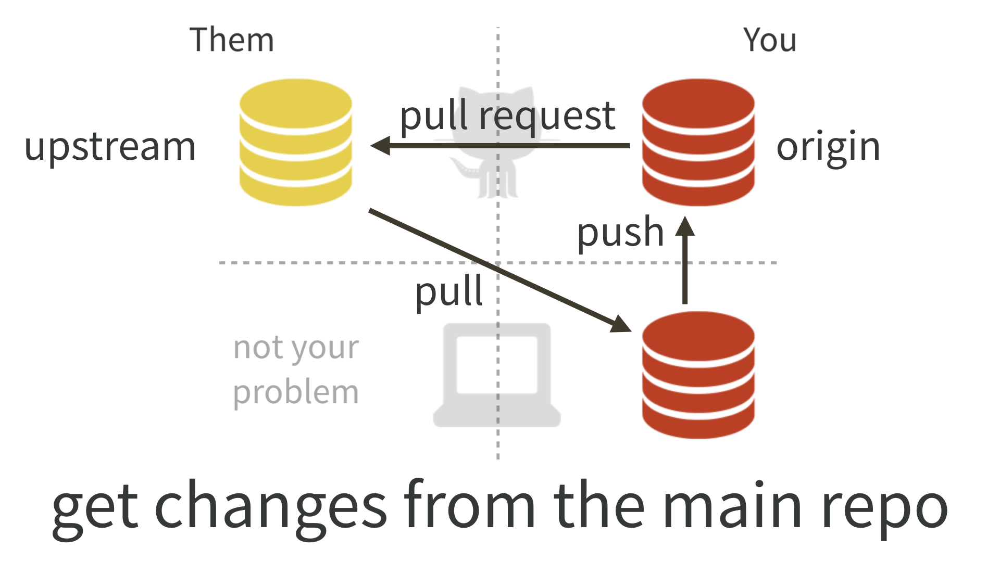

# Get upstream changes for a fork {#upstream-changes}

This workflow is relevant if you have done [fork and clone](#fork-and-clone) and now you need to pull subsequent changes from the original repo into your copy.

Sometimes you set this up right away, when you fork and clone, even though you don't need it yet. Congratulations, you are planning for the future!

It's also very typical to do this step a few days or months later. Maybe you're taking an interest in someone else's work for the second time and you want to make another pull request. Or you just want your copy to reflect their recent work. It is also totally normal to set this up upon first need.

Vocabulary: `OWNER/REPO` refers to the original GitHub repo, owned by `OWNER`, who is not you. `YOU/REPO` refers to your copy on GitHub, i.e. your fork.

## No, you can't do this via GitHub

You might hope that GitHub could automatically keep your fork `YOU/REPO` synced up with the original `OWNER/REPO`. Or that you could do this in the browser interface. Then you could pull those upstream changes into your local repo.

But you can't.

There are some tantalizing, janky ways to sort of do parts of this. But they have fatal flaws that make them unsustainable. I believe you really do need to add `OWNER/REPO` as a second remote on your repo and pull from there.

## Initial conditions

Get into the repo of interest, i.e. your local copy. For many of you, this means launching it as an RStudio Project. You'll probably also want to open a terminal within RStudio for some Git work via *Tools > Terminal > New Terminal*.

Make sure you are on the `master` branch and your "working tree is clean". `git status` should show something like:

``` bash
On branch master
Your branch is up to date with 'origin/master'.

nothing to commit, working tree clean
```

BTW I recommend that you [never make your own commits to the `master` branch of a fork](#dont-touch-master). However, if you have already done so, we are going to address your sorry situation below.

## List your remotes

Let's inspect [the current remotes](#git-remotes) for your local repo. In the shell:

``` bash
git remote -v
```

Most of you will see output along these lines (let's call this BEFORE):

``` bash
origin  https://github.com/YOU/REPO.git (fetch)
origin  https://github.com/YOU/REPO.git (push)
```

There is only one remote, named `origin`, corresponding to your fork on GitHub. This figure depicts a BEFORE scenario:



This is sad, because there is no direct connection between `OWNER/REPO` and your local copy of the repo.

The state we want to see is like this (let's call this AFTER):

``` bash
origin    https://github.com/YOU/REPO.git (fetch)
origin    https://github.com/YOU/REPO.git (push)
upstream  https://github.com/OWNER/REPO.git (fetch)
upstream  https://github.com/OWNER/REPO.git (push)
```

Notice the second remote, named `upstream`, corresponding to the original repo on GitHub. This figure depicts AFTER, the scenario we want to achieve:



Sidebar: If you used `usethis::create_from_github("OWNER/REPO")` for your original "fork and clone", the `upstream` should already be set up. In that case, you can skip to the part where we pull from `upstream`.

## Add the `upstream` remote

Let us add `OWNER/REPO` as the `upstream` remote.

On [GitHub](https://github.com), make sure you are signed in and navigate to the original repo, `OWNER/REPO`. It is easy to get to from your fork, `YOU/REPO`, via "forked from" links near the top.

Use the big green "Clone or download" button to get the URL for `OWNER/REPO` on your clipboard. Be intentional about whether you copy the HTTPS or SSH URL.

### Command line Git

Use a command like this, but make an intentional choice about using an HTTPS vs SSH URL.

``` bash
git remote add upstream https://github.com/OWNER/REPO.git
```

The nickname `upstream` can technically be whatever you want. There is a strong tradition of using `upstream` in this context and, even though I have better ideas, I believe it is best to conform. Every book, blog post, and Stack Overflow thread that you read will use `upstream` here. Save your psychic energy for other things.

### RStudio

This feels a bit odd, but humor me. Click on "New Branch" in the Git pane.

]

This will reveal a button to "Add Remote". Click it. Enter `upstream` as the remote name and paste the URL for `OWNER/REPO` that you got from GitHub. Click "Add". Decline the opportunity to add a new branch by clicking "Cancel".

## Verify your `upstream` remote

Let's inspect [the current remotes](#git-remotes) for your local repo AGAIN. In the shell:

``` bash
git remote -v
```

Now you should see something like

``` bash
origin    https://github.com/YOU/REPO.git (fetch)
origin    https://github.com/YOU/REPO.git (push)
upstream  https://github.com/OWNER/REPO.git (fetch)
upstream  https://github.com/OWNER/REPO.git (push)
```

Notice the second remote, named `upstream`, corresponding to the original repo on GitHub. We have gotten to this:


## Pull changes from `upstream`

Now we can pull the changes that we don't have from `OWNER/REPO` into our local copy.


``` bash
git pull upstream master --ff-only
```

This says: "pull the changes from the remote known as `upstream` into the `master` branch of my local repo". We are being explicit about the remote and the branch in this case, because (as our `git remote -v` commands reveal), `upstream/master` is **not** the default tracking branch for local `master`.

I **highly recommend** using the `--ff-only` flag in this case, so that you also say "if I have made my own commits to `master`, please force me to confront this problem NOW". Here's what it looks like if a fast-forward merge isn't possible:

``` bash
$ git pull upstream master --ff-only
From github.com:OWNER/REPO
 * branch              master     -> FETCH_HEAD
fatal: Not possible to fast-forward, aborting.
```

See [Um, what if I did touch `master`?](#touched-master) to get yourself back on the happy path.

## Push these changes to `origin/master`

This is, frankly, totally optional and many people who are facile with Git do not bother.

If you take my advice to [never work in `master` of a fork](#dont-touch-master), then the state of the `master` branch in your fork `YOU/REPO` does not matter. You will never make a pull request from `master`.

If, however, your grasp of all these Git concepts is tenuous at best, it can be helpful to try to keep things simple and orderly and synced up.

Feel free to push the newly updated state of local `master` to your fork `YOU/REPO` and enjoy the satisfaction of being "caught up" with `OWNER/REPO`.

In the shell:

``` bash
git push
```

Or use the green "Push" button in RStudio.

## Um, what if I did touch `master`? {#touched-master}

I told you not to!

But OK here we are.

Let's imagine this is the state of the original repo `OWNER/REPO`:

``` bash
... -- A -- B -- C -- D -- E -- F
```

and and this is the state of the `master` branch in your local copy:

``` bash
... -- A -- B -- C -- X -- Y -- Z
```

The two histories agree, up to commit or state `C`, then they diverge.

If you want to preserve the work in commits `X`, `Y`, and `Z`, create a new branch right now, with tip at `Z`, via `git checkout -b my-great-innovations` (pick your own branch name!). Then checkout `master` via `git checkout master`.

I now assume you have either preserved the work in `X`, `Y`, and `Z` (with a branch) or have decided to let it go.

Do a hard reset of the `master` branch to `C`.

``` bash
git reset --hard C
```

You will have to figure out how to convey `C` in Git-speak. Specify it relative to `HEAD` or provide the SHA. See *future link about resets* for more support.

The instructions above for pulling changes from upstream should now work. Your `master` branch should reflect the history of `OWNER/REPO`:

``` bash
... -- A -- B -- C -- D -- E -- F
```

If you chose to create a branch with your work, you will also have that locally:


``` bash
... -- A -- B -- C -- D -- E -- F (master)
                   \
                    -- X -- Y -- Z (my-great-innovations)
```

If you pushed your alternative history (with commits `X`, `Y`, and `Z`) to your fork `YOU/REPO` and you like keeping everything synced up, you will also need to force push `master` via `git push --force`, but we really really don't like discussing force pushes in Happy Git. We only do so here, because we are talking about a fork, which is fairly easy to replace if things so sideways.
