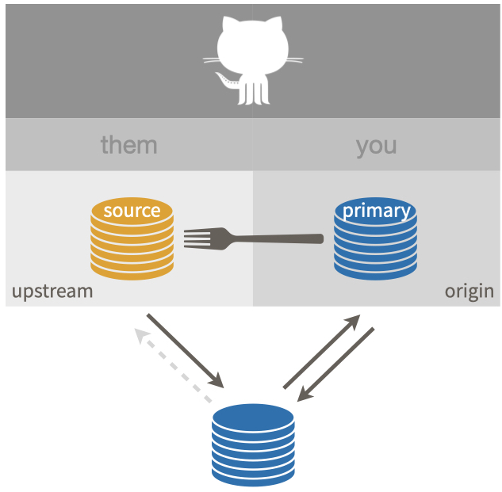

# Get upstream changes for a fork {#upstream-changes}

This workflow is relevant if you have done [fork and clone](#fork-and-clone) and now you need to pull subsequent changes from the source repo into your copy.
We are talking about both your fork (your remote copy of the repo, on GitHub) and your local copy.

This is the ideal starting situation:

```{r}
#| echo = FALSE, fig.align = "center", out.width = "60%",
#| fig.alt = "Fork and clone, ideal setup."
knitr::include_graphics("img/fork-them-pull-request.jpeg")
```

First, we're going to actively verify the above configuration.
If your setup is sub-optimal, we'll discuss how to address that.

## Verify your local repo's configuration

Vocabulary: `OWNER/REPO` refers to what we call the **source** repo, owned by `OWNER`, who is not you.
`YOU/REPO` refers to your fork, i.e. your remote copy of the source repo, on GitHub.
This is the same vocabulary used elsewhere, such as the chapter on [common remote configurations](#common-remote-setups).

### List your remotes

Let's inspect [the current remotes](#git-remotes) for your local repo.

You can check this with command line Git in the shell (Appendix \@ref(shell)):

``` bash
git remote -v
```

We want to see something like this:

``` bash
origin    https://github.com/YOU/REPO.git (fetch)
origin    https://github.com/YOU/REPO.git (push)
upstream  https://github.com/OWNER/REPO.git (fetch)
upstream  https://github.com/OWNER/REPO.git (push)
```

Comparable info is available in R with `usethis::git_remotes()`:

```{r eval = FALSE}
git_remotes()
#> $origin
#> [1] "https://github.com/YOU/REPO.git"
#> 
#> $upstream
#> [1] "https://github.com/OWNER/repo.git"
```

If you only have one remote, probably `origin`, I highly recommend you modify the remote configuration.
But first, we'll check one other thing.

### View the upstream tracking branch

Ideally, your local `main` branch has `upstream/main` as its upstream tracking branch.
Even you have a correctly configured `upstream` remote, this is worth checking.
If your default branch has a branch other than `main`, substitute accordingly.

In the shell, with the default branch checked out, `git branch -vv` should reveal that `upstream/main` is the upstream tracking branch:

``` bash
~/some/repo/ % git branch -vv                   
* main 2739987 [upstream/main] Some commit message
```

If, instead, you see `origin/main`, I highly recommend you reconfigure the tracking branch.

All of this info about remotes and branches is also included in the rich information reported with `usethis::git_sitrep()`.

### Repair or complete your repo's configuration

Instructions for adding the `upstream` remote and setting upstream tracking for your default branch are given in [Finish the fork and clone setup](#fork-and-clone-finish).

## Verify that your "working tree is clean"

We assume your repo has this favorable configuration:

```{r fork-them}
#| echo = FALSE, fig.align = "center", out.width = "60%",
#| fig.alt = "Setup described as \"fork\""

```

Make sure you are on the default branch, e.g. `main`, and that your "working tree is clean".
First, let's make sure our information on the `upstream` remote is current:

``` bash
git fetch upstream
```

`git status` should now show something like:

``` bash
On branch main
Your branch is up to date with 'origin/main'.

nothing to commit, working tree clean
```

If you have modified files, you should either discard those changes or create a new branch and commit the changes there for safekeeping.

It's also fine if you see something like this:

```
Your branch is behind 'upstream/main' by 2 commits, and can be fast-forwarded.
```

However, if you see something like this:

```
Your branch is ahead of 'upstream/main' by 1 commit.
```

or this:

```
Your branch and 'upstream/main' have diverged,
and have 1 and 1 different commits each, respectively.
```

this is a sign that you have made some regrettable choices.

I recommend that you [never make your own commits to the default branch of a fork](#fork-dont-touch-main) or to any branch that you don't effectively (co-)own.
However, if you have already done so, we explain how to fix the problem in [Um, what if I did touch `main`?](#touched-main).

## Sync option 1: Pull changes from `upstream`, then push to `origin`

Now we are ready to pull the changes that we don't have from the source repo `OWNER/REPO` into our local copy.

``` bash
git pull upstream main --ff-only
```

This says: "pull the changes from the remote known as `upstream` into the `main` branch of my local repo".
I am being explicit about the remote (`upstream`) and the branch (`main`) in this case, both to make it more clear and to make this command robust to repo- and user-level Git configurations.
But if you've followed our setup recommendations, you don't actually need to be this explicit.

I also **highly recommend** using the `--ff-only` flag in this case, so that you also say "if I have made my own commits to `main`, please force me to confront this problem NOW".
Here's what it looks like if a fast-forward merge isn't possible:

``` bash
$ git pull upstream main --ff-only
From github.com:OWNER/REPO
 * branch              main     -> FETCH_HEAD
fatal: Not possible to fast-forward, aborting.
```

See [Um, what if I did touch `main`?](#touched-main) to get yourself back on the happy path.

Assuming you've succeeded with `git pull`, this next step is optional and many people who are facile with Git do not bother.

If you take my advice to [never work in `main` of a fork](#fork-dont-touch-main), then the state of the `main` branch in your fork `YOU/REPO` does not technically matter.
You will never make a pull request from `main` and there are ways to set the correct base for the branches and pull requests that you do create.

If, however, your grasp of all these Git concepts is tenuous at best, it can be helpful to try to keep things simple and orderly and synced up.

Feel free to push the newly updated state of local `main` to your fork `YOU/REPO` and enjoy the satisfaction of being "caught up" with `OWNER/REPO`, in both your remote fork and in your local repo.

In the shell:

``` bash
git push origin main
```

If you've followed our configuration advice, you really do need to be this explicit in order to push to `origin` (not `upstream`).

## Sync option 2: Sync your fork on GitHub, pull changes from `origin` to local repo

For many years, this was not possible, though many GitHub users wished for this feature.
Happily it is now possible to sync a fork with its source repo in the browser, i.e. to do the sync between the 2 GitHub repos.
The official GitHub documentation for this is [Syncing a fork from the web UI](https://docs.github.com/en/pull-requests/collaborating-with-pull-requests/working-with-forks/syncing-a-fork#syncing-a-fork-from-the-web-ui).

Navigate to the main page of your fork `YOU/REPO`, i.e. your primary repo which is configured as the `origin` remote.

At the top you'll see some information on how the state of `main` in your fork relates to `main` in the source repo, similar to what we see with `git status` in the alternative approach above.
Ideally you will see something like:

```
This branch is 2 commits behind OWNER:main.
```

which indicates you can sync up in the ideal fast-forward sense.

If you see something like this:

```
This branch is 1 commit ahead, 2 commits behind OWNER:main.
```

this is a sign that you have made some regrettable choices.

I recommend that you [never make your own commits to the default branch of a fork](#fork-dont-touch-main) or to any branch that you don't effectively (co-)own.
However, if you have already done so, we explain how to fix the problem in [Um, what if I did touch `main`?](#touched-main).

Once you are ready to proceed, click "Fetch upstream" in the upper right corner and then "Fetch and merge".
Upon success, the main page of `YOU/REPO` shows something like

> This branch is up to date with `OWNER/REPO:main`.

If you have made commits on the default branch of your fork, which we [strongly advise against](#fork-dont-touch-main), this can result in a merge commit (or even merge conflicts).
If you are suffering due to commits you've made on `main` and it's beyond the help we describe below, consider deleting your fork and local repo and making a fresh start with [Fork and clone](fork-and-clone).
Live and learn.

Once you have successfully synced the default branch of `YOU/REPO` with the default branch of `OWNER/REPO`, you probably want to do the same for your local repo.
Since they are synced, you can pull from either `upstream` or `origin`.

In the shell, with the default branch checked out, execute one of these:

``` bash
git pull upstream main --ff-only
git pull origin main --ff-only
```

If you've followed our configuration advice, you don't actually need to specify the remote and branch, because this branch is configured to pull from `upstream`.
For the same reasons as before, it's a good idea to include the `--ff-only` flag.
If you have made local commits to `main`, this will surface that problem, which is solved in the next section.

## Um, what if I did touch `main`? {#touched-main}

I told you not to!

But OK here we are.

Let's imagine this is the state of `main` (or whatever the default branch is called) in the source repo `OWNER/REPO`:

``` bash
... -- A -- B -- C -- D -- E -- F
```

and and this is the state of the `main` branch in your local copy:

``` bash
... -- A -- B -- C -- X -- Y -- Z
```

The two histories agree, up to commit or state `C`, then they diverge.

If you want to preserve the work in commits `X`, `Y`, and `Z`, create a new branch right now, with tip at `Z`, like so, but substituting your preferred branch name:

``` bash
git checkout -b my-great-innovations
```

This safeguards your great innovations from commits `X`, `Y`, and `Z`.
Now checkout `main` again:

``` bash
git checkout main
```

I now assume you have either preserved the work in `X`, `Y`, and `Z` (with a branch) or have decided to let it go.

Do a hard reset of the `main` branch to `C`.

``` bash
git reset --hard C
```

You will have to figure out how to convey `C` in Git-speak.
Specify it relative to `HEAD` or provide the SHA.
See *future link about time travel* for more support.

<!-- TODO: come back when there is content about referring to previous states. -->

The history of your `main` branch is now compatible with its history in `OWNER/REPO`.
The instructions above for pulling changes from `upstream` should now work.
A fast-forward-only pull should succeed.

``` bash
git pull upstream main --ff-only
```

And now your local history for `main` should match that in the source repo:

``` bash
... -- A -- B -- C -- D -- E -- F
```

If you chose to create a branch with your work, you will also have that locally:


``` bash
... -- A -- B -- C -- D -- E -- F (main)
                   \
                    -- X -- Y -- Z (my-great-innovations)
```

If you pushed your alternative history (with commits `X`, `Y`, and `Z`) to your fork `YOU/REPO` and you like keeping everything synced up, you will also need to force push `main` to the `origin` remote:

``` bash
git push --force origin main
```

We really, really don't like discussing force pushes in Happy Git, though.
We only do so here, because we are talking about a fork, which is fairly easy to replace if things go sideways.
